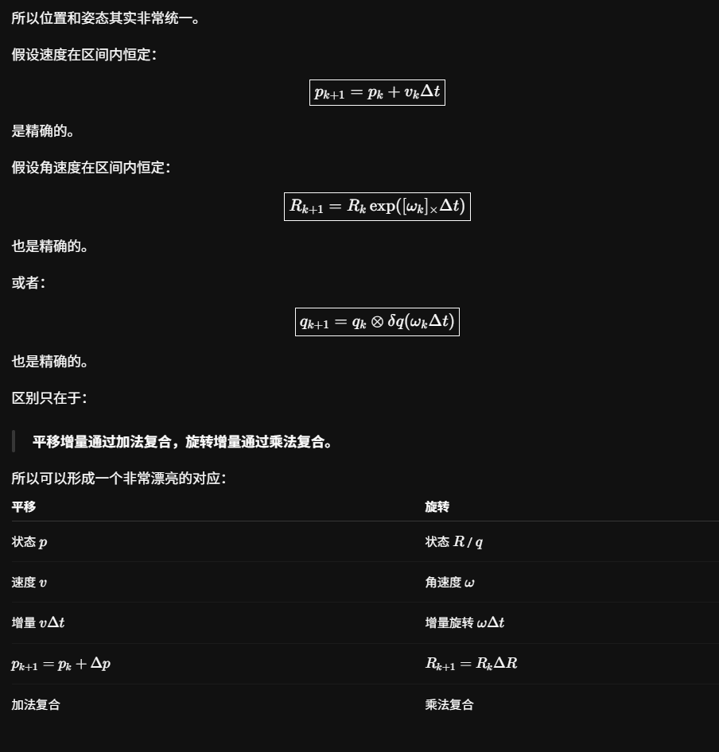
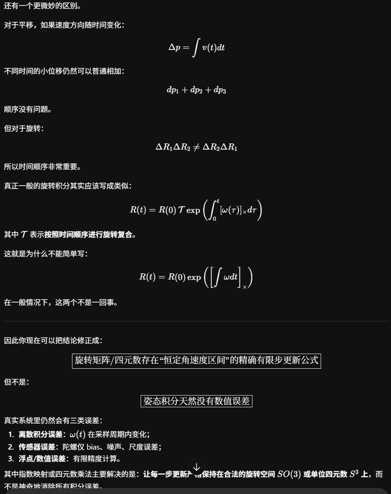
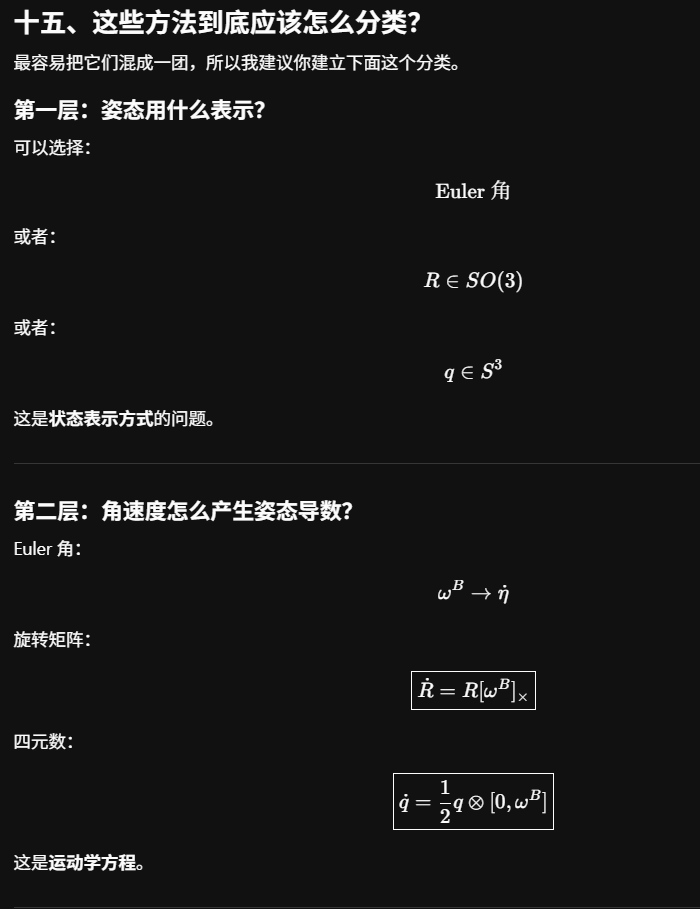
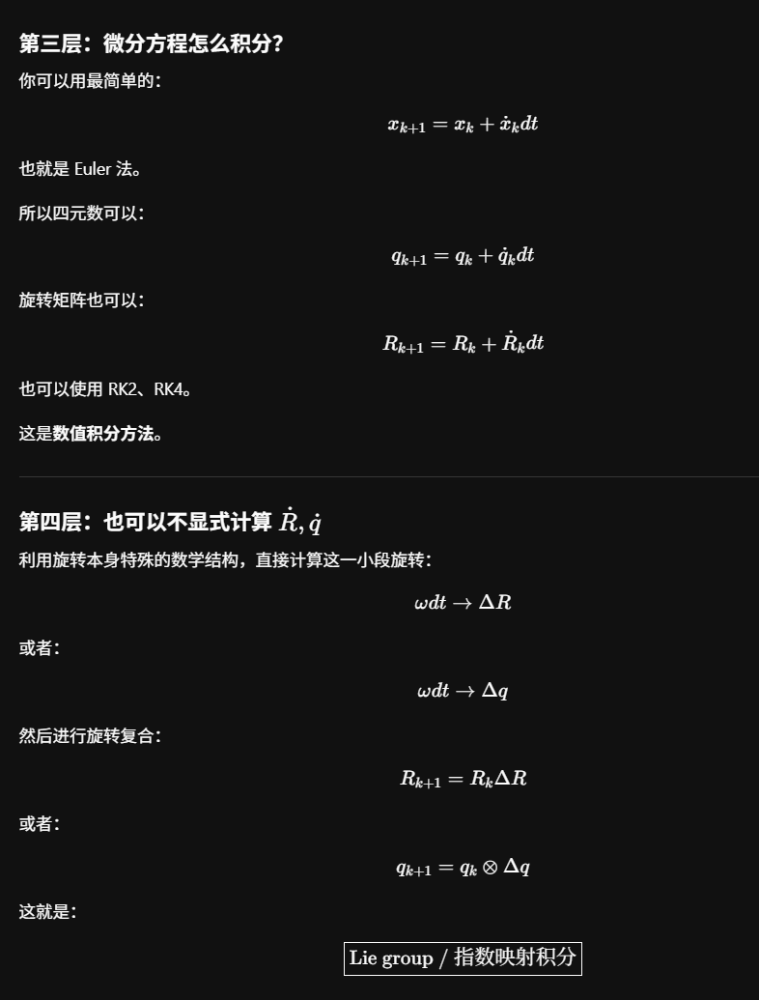
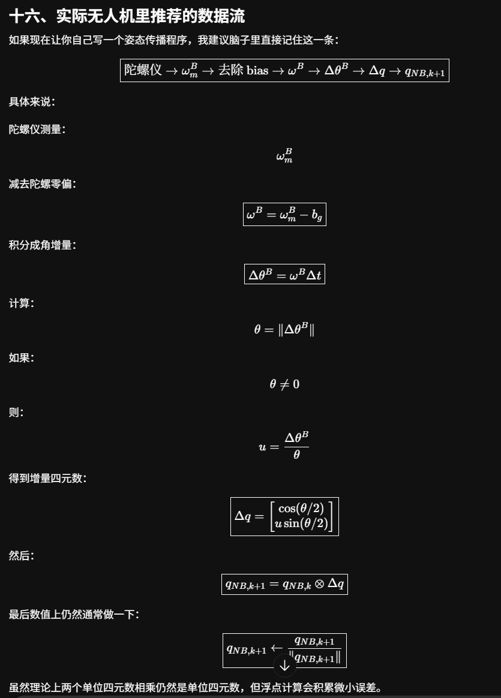
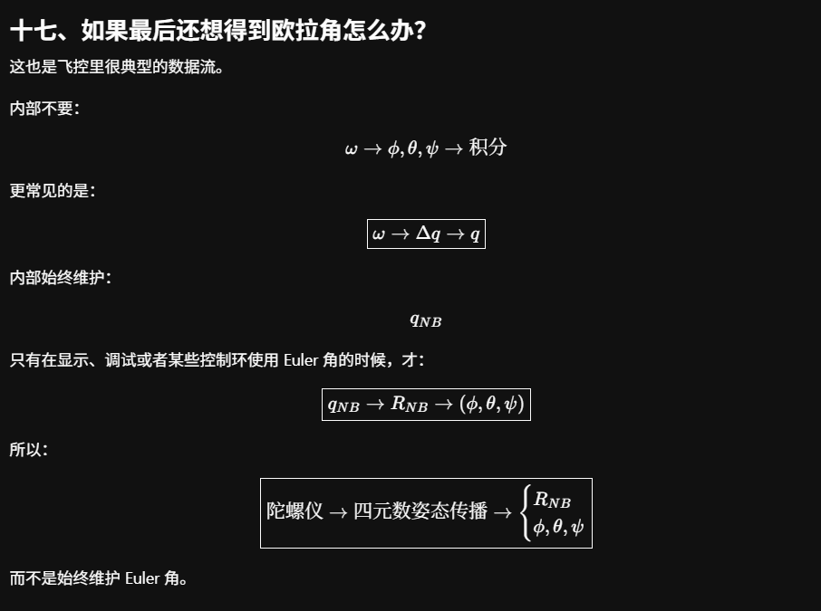
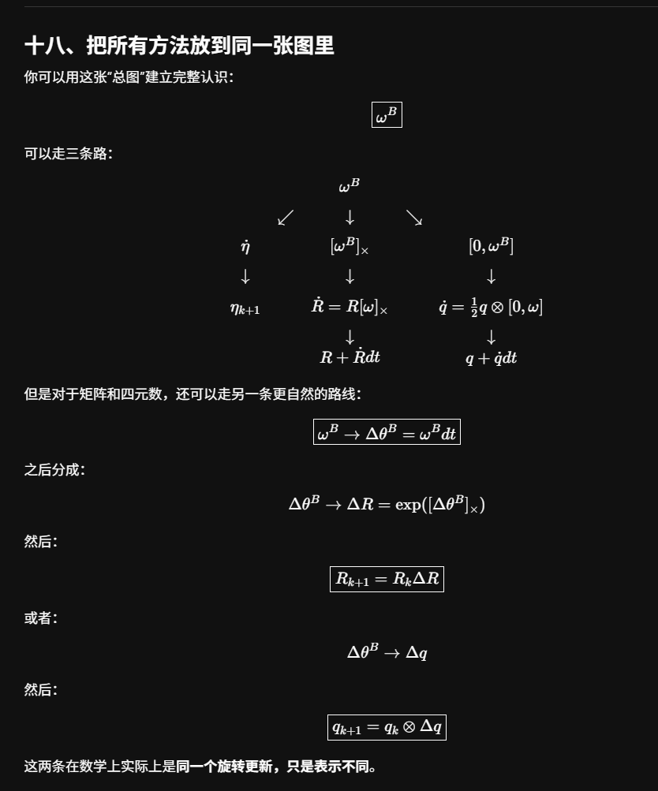
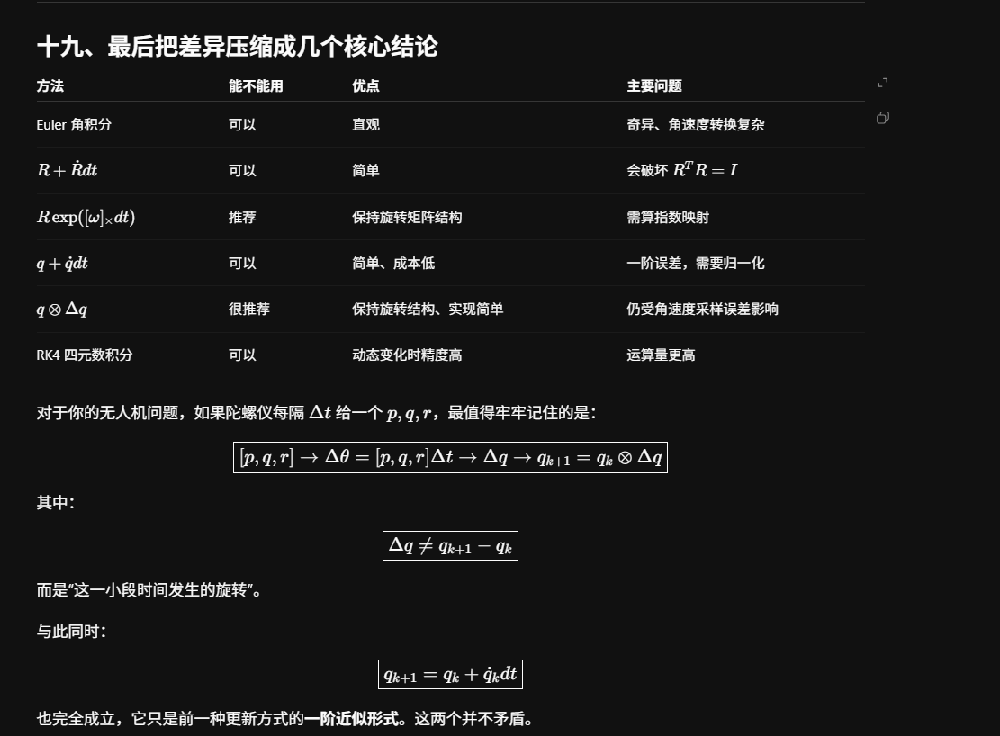

# 无人机姿态运动学与姿态积分学习笔记

本文系统整理无人机姿态的几何含义、欧拉角的内禀与外禀解释、机体系角速度 $p,q,r$ 与欧拉角导数的关系，以及旋转矩阵和四元数的姿态积分方法。最核心的结论是：

> 陀螺仪测得的 $[p,q,r]^T$ 是同一个瞬时角速度向量在当前机体系三根轴上的分量；$[\dot\phi,\dot\theta,\dot\psi]^T$ 是一组欧拉角参数的变化率。两者一般不相等。

> $\boldsymbol\omega\Delta t$ 是一个小旋转向量，不是欧拉角增量。姿态的物理累积是旋转复合，因此旋转矩阵和四元数采用乘法更新。

> $q_k+\dot q_k\Delta t$ 是在外部坐标空间中沿切线做一阶 Euler 近似，$q_k\otimes\Delta q_k$ 是在单位四元数群上复合一段合法旋转；二者的一阶项相同，但几何意义不同。这里 $\Delta q_k$ 表示相对旋转，并不等于 $q_{k+1}-q_k$。

## 1 坐标系与符号约定

为避免不同教材、软件和飞控约定造成歧义，本文统一采用以下约定。

### 1.1 导航系与机体系

- 导航系 $N$：NED，三轴分别为 North、East、Down。
- 机体系 $B$：FRD，三轴分别为 Forward、Right、Down。
- $F=x_B$、$R=y_B$、$D=z_B$。
- 两个坐标系都是右手坐标系。

### 1.2 旋转矩阵

定义 $R_{NB}$ 将向量的机体系坐标转换为导航系坐标：

$$
\boxed{\mathbf v^N=R_{NB}\mathbf v^B}
$$

因此：

$$
R_{BN}=R_{NB}^{-1}=R_{NB}^T
$$

而且 $R_{NB}$ 的三列正是机体系三根单位轴在导航系中的表达：

$$
\boxed{
R_{NB}=
\begin{bmatrix}
|&|&|\\
F^N&R^N&D^N\\
|&|&|
\end{bmatrix}}
$$

这里必须区分两种语言：

- “$R_{NB}$ 描述 $B$ 相对 $N$ 的姿态”是在描述两个坐标系的方向关系；
- “$R_{NB}$ 把 $B$ 系坐标转换成 $N$ 系坐标”是在描述同一物理向量的坐标变换。

二者相容，但不要把“主动旋转物体”和“被动转换坐标表达”的措辞混在一起。

### 1.3 ZYX 欧拉角

定义：

$$
\phi=\text{roll},\qquad
\theta=\text{pitch},\qquad
\psi=\text{yaw}
$$

采用常见的 ZYX 约定：

$$
\boxed{R_{NB}=R_z(\psi)R_y(\theta)R_x(\phi)}
$$

其中

$$
R_x(\phi)=
\begin{bmatrix}
1&0&0\\
0&\cos\phi&-\sin\phi\\
0&\sin\phi&\cos\phi
\end{bmatrix}
$$

$$
R_y(\theta)=
\begin{bmatrix}
\cos\theta&0&\sin\theta\\
0&1&0\\
-\sin\theta&0&\cos\theta
\end{bmatrix}
$$

$$
R_z(\psi)=
\begin{bmatrix}
\cos\psi&-\sin\psi&0\\
\sin\psi&\cos\psi&0\\
0&0&1
\end{bmatrix}
$$

在 NED/FRD 约定下，正 roll 对应右翼向下，正 pitch 对应机头上仰，正 yaw 对应航向向右增加。

## 2 姿态是什么

姿态的本质是：

$$
\boxed{\text{机体系 }B\text{ 相对于导航系 }N\text{ 的方向关系}}
$$

它可以用不同形式表示：

| 表示方法 | 参数数量 | 主要特点 |
|---|---:|---|
| ZYX 欧拉角 $(\phi,\theta,\psi)$ | 3 | 直观，适合显示和人机交互；存在奇异点 |
| 旋转矩阵 $R\in SO(3)$ | 9 | 几何意义直接；有正交和行列式约束 |
| 单位四元数 $q$ | 4 | 紧凑、无欧拉角万向节死锁；需维持单位范数 |

这些不是三种不同的物理姿态，而是同一个姿态的三种表达。

欧拉角尤其需要正确理解：它不是“机体系三根轴分别与导航系三根轴的夹角”，也不是一个普通的三维角度向量。它是按照指定旋转顺序对姿态进行参数化后得到的三个数。

## 3 内禀 ZYX 与外禀 XYZ

### 3.1 内禀 ZYX

内禀旋转的轴会随机体更新。对本文约定：

1. 绕初始的 $z_N$ 轴转 yaw $\psi$，得到中间系 1；
2. 绕更新后的 $y_1$ 轴转 pitch $\theta$，得到中间系 2；
3. 绕更新后的 $x_2=x_B$ 轴转 roll $\phi$，得到最终机体系 $B$。

因此三个欧拉旋转轴依次是：

$$
\boxed{z_N\rightarrow y_1\rightarrow x_B}
$$

### 3.2 外禀 XYZ

同一个最终姿态也可以等价理解为绕导航系固定轴旋转：

1. 绕固定 $X_N$ 轴转 $\phi$；
2. 绕固定 $Y_N$ 轴转 $\theta$；
3. 绕固定 $Z_N$ 轴转 $\psi$。

在本文统一的主动旋转和矩阵约定下：

$$
\boxed{\text{内禀 ZYX}\equiv\text{外禀 XYZ}}
$$

“等价”只表示最终旋转矩阵相同，不表示两种解释中的中间坐标轴相同。

### 3.3 为什么旋转顺序不能省略

三维有限旋转一般不可交换：

$$
R_x(\alpha)R_y(\beta)\neq R_y(\beta)R_x(\alpha)
$$

因此只说“roll、pitch、yaw 都是 $30^\circ$”仍不够，还必须说明旋转顺序、内禀或外禀、主动或被动、坐标系方向以及矩阵或四元数的定义。

## 4 从最终姿态几何地理解 ZYX 欧拉角

将

$$
R_{NB}=R_z(\psi)R_y(\theta)R_x(\phi)
$$

展开为：

$$
R_{NB}=
\begin{bmatrix}
c_\psi c_\theta & c_\psi s_\theta s_\phi-s_\psi c_\phi & c_\psi s_\theta c_\phi+s_\psi s_\phi\\
s_\psi c_\theta & s_\psi s_\theta s_\phi+c_\psi c_\phi & s_\psi s_\theta c_\phi-c_\psi s_\phi\\
-s_\theta & c_\theta s_\phi & c_\theta c_\phi
\end{bmatrix}
$$

其中 $c_\alpha=\cos\alpha$，$s_\alpha=\sin\alpha$。三列依次是 $F^N,R^N,D^N$。

### 4.1 Yaw 看机头的水平投影

设

$$
F^N=
\begin{bmatrix}
F_x&F_y&F_z
\end{bmatrix}^T
$$

其在 $X_NY_N$ 平面的投影为：

$$
F_h=
\begin{bmatrix}
F_x&F_y&0
\end{bmatrix}^T
$$

则：

$$
\boxed{\psi=\operatorname{atan2}(F_y,F_x)}
$$

几何意义是“机头在水平面上的影子朝向哪里”。

### 4.2 Pitch 看机头相对水平面的仰俯

在 NED 中，向下是正方向，因此机头上仰时 $F_z<0$。有：

$$
\boxed{
\theta=
\operatorname{atan2}
\left(-F_z,\sqrt{F_x^2+F_y^2}\right)}
$$

也就是机头 $F$ 与其水平投影 $F_h$ 之间的有符号角。

### 4.3 Roll 要看绕机头轴的扭转

只知道 $F$ 可以确定 yaw 和 pitch，却不能确定 roll。原因是保持机头方向不变时，机体仍可以绕 $F$ 轴转动。

在标准 ZYX 主值分支 $|\theta|<90^\circ$ 内，可以构造零 roll 参考方向。将导航系 Down 轴 $z_N$ 投影到垂直于 $F$ 的平面 $F^\perp$：

$$
\widetilde D_0=z_N-(z_N\cdot F)F
$$

$$
\boxed{
D_0=
\frac{z_N-(z_N\cdot F)F}
{\left\|z_N-(z_N\cdot F)F\right\|}}
$$

$D_0$ 表示在保持当前机头方向不变时，零 roll 姿态应有的 Down 方向。于是：

$$
\boxed{
\phi=
\operatorname{atan2}
\left(
F\cdot(D_0\times D),
D_0\cdot D
\right)}
$$

也可以令：

$$
R_0=D_0\times F
$$

再计算：

$$
\boxed{
\phi=
\operatorname{atan2}
\left(
F\cdot(R_0\times R),
R_0\cdot R
\right)}
$$

在标准分支 $|\theta|<90^\circ$ 内，还有更紧凑的等价形式：

$$
\boxed{
\phi=\operatorname{atan2}(z_N\cdot R,\ z_N\cdot D)}
$$

### 4.4 从旋转矩阵直接提取

若

$$
R_{NB}=
\begin{bmatrix}
r_{11}&r_{12}&r_{13}\\
r_{21}&r_{22}&r_{23}\\
r_{31}&r_{32}&r_{33}
\end{bmatrix}
$$

且 $|\theta|<90^\circ$，则：

$$
\boxed{\psi=\operatorname{atan2}(r_{21},r_{11})}
$$

$$
\boxed{
\theta=\operatorname{atan2}
\left(-r_{31},\sqrt{r_{11}^2+r_{21}^2}\right)}
$$

$$
\boxed{\phi=\operatorname{atan2}(r_{32},r_{33})}
$$

### 4.5 常见错误投影

- 最终 $F$ 与水平面的有符号夹角等于 pitch。
- 最终 $F$ 的水平投影与 $X_N$ 的有符号夹角等于 yaw。
- 最终 $R$ 与水平面的夹角一般不等于 roll。
- 最终 FR 平面与水平面的二面角一般也不等于 roll。

原因是后续旋转会继续改变先前已旋转过的机体系轴。欧拉角是旋转序列的参数，不是最终对应轴或平面之间的三个直接夹角。

### 4.6 三个角均为 $30^\circ$ 的例子

令：

$$
\phi=\theta=\psi=30^\circ
$$

则：

$$
R_{NB}=
\begin{bmatrix}
0.7500&-0.2165&0.6250\\
0.4330&0.8750&-0.2165\\
-0.5000&0.4330&0.7500
\end{bmatrix}
$$

可以直接验证：

- $F$ 的水平投影航向为 $30^\circ$，所以 $\psi=30^\circ$；
- $F$ 与水平面的仰角为 $30^\circ$，所以 $\theta=30^\circ$；
- $\operatorname{atan2}(0.4330,0.7500)=30^\circ$，所以 $\phi=30^\circ$；
- $F$ 与 $X_N$ 的直接夹角约为 $41.4^\circ$，不是 pitch；
- $R$ 与水平面的夹角约为 $25.66^\circ$，不是 roll；
- FR 平面与水平面的二面角约为 $41.4^\circ$，也不是 roll。

## 5 角速度 $p,q,r$ 与欧拉角导数为什么不同

### 5.1 陀螺仪测得的量

无人机在某一时刻只有一个真实的角速度向量 $\boldsymbol\omega$。陀螺仪将其表达在当前机体系 $B$ 中：

$$
\boxed{
\boldsymbol\omega^B=
\begin{bmatrix}
p\\q\\r
\end{bmatrix}}
$$

即：

$$
\boldsymbol\omega=p\,x_B+q\,y_B+r\,z_B
$$

所以 $p,q,r$ 全部是相对于同一个当前机体系的正交分量。

### 5.2 欧拉角导数对应不同阶段的轴

对内禀 ZYX：

- $\dot\psi$ 对应绕 $z_N$；
- $\dot\theta$ 对应绕中间轴 $y_1$；
- $\dot\phi$ 对应绕最终轴 $x_B$。

因此总角速度为：

$$
\boxed{
\boldsymbol\omega=
\dot\phi\,x_B+
\dot\theta\,y_1+
\dot\psi\,z_N}
$$

这三个轴一般不互相重合，也不全是最终机体系的轴。因此欧拉角导数不是同一个向量在同一组正交基下的三个分量。

### 5.3 转换矩阵的几何推导

推导的关键是区分“坐标系经过怎样的旋转”和“某一根物理轴在另一个坐标系中的坐标表达”。

继续采用：

$$
R_{NB}=R_z(\psi)R_y(\theta)R_x(\phi)
$$

以及：

$$
\mathbf v^N=R_{NB}\mathbf v^B
$$

对内禀 ZYX，引入两个中间坐标系：

$$
N
\xrightarrow{\psi\text{ 绕 }z_N}
1
\xrightarrow{\theta\text{ 绕 }y_1}
2
\xrightarrow{\phi\text{ 绕 }x_2}
B
$$

其中：

$$
z_1=z_N,\qquad y_2=y_1,\qquad x_B=x_2
$$

欧拉角导数产生的总角速度为：

$$
\boldsymbol\omega
=
\dot\phi\,x_B
+
\dot\theta\,y_1
+
\dot\psi\,z_N
$$

IMU 输出是同一角速度向量在最终机体系 $B$ 中的表达。因此，需要把 $x_B$、$y_1$ 和 $z_N$ 全部转换成 $B$ 系坐标。

#### 5.3.1 第一根轴 $x_B^B$

$x_B$ 就是 $B$ 系自身的 $x$ 轴，所以：

$$
\boxed{
x_B^B=
\begin{bmatrix}
1\\0\\0
\end{bmatrix}}
$$

同理：

$$
y_B^B=
\begin{bmatrix}
0\\1\\0
\end{bmatrix},
\qquad
z_B^B=
\begin{bmatrix}
0\\0\\1
\end{bmatrix}
$$

所以 $\dot\phi x_B$ 在 $B$ 系中的表达为：

$$
\dot\phi
\begin{bmatrix}
1\\0\\0
\end{bmatrix}
$$

#### 5.3.2 第二根轴 $y_1^B$

第二步 pitch 是绕 $y_1$ 轴进行的，因此这根轴在第二步旋转前后不变：

$$
y_2=y_1
$$

第三步由坐标系 2 绕 $x_2$ 轴旋转 $\phi$ 得到最终机体系 $B$。按照“右下标坐标转换到左下标坐标”的记号：

$$
R_{2B}=R_x(\phi),
\qquad
\mathbf v^2=R_{2B}\mathbf v^B
$$

若要把坐标系 2 中的表达转换到坐标系 $B$，应使用逆变换：

$$
R_{B2}
=
R_{2B}^{-1}
=
R_x(-\phi)
$$

因为 $y_1=y_2$，所以：

$$
y_1^2=
\begin{bmatrix}
0\\1\\0
\end{bmatrix}
$$

进而：

$$
y_1^B
=
R_{B2}y_1^2
=
R_x(-\phi)
\begin{bmatrix}
0\\1\\0
\end{bmatrix}
$$

其中：

$$
R_x(-\phi)=
\begin{bmatrix}
1&0&0\\
0&\cos\phi&\sin\phi\\
0&-\sin\phi&\cos\phi
\end{bmatrix}
$$

相乘得到：

$$
\boxed{
y_1^B=
\begin{bmatrix}
0\\
\cos\phi\\
-\sin\phi
\end{bmatrix}}
$$

从几何上看，最终 $B$ 系相对坐标系 2 绕 $x_B$ 正向转过了 $\phi$。反过来站在最终 $B$ 系观察原来的 $y_2=y_1$，相当于看它反向转过 $-\phi$，因此：

$$
\boxed{
y_1
=
\cos\phi\,y_B
-
\sin\phi\,z_B}
$$

这也直接给出 $y_1^B=[0,\cos\phi,-\sin\phi]^T$。

#### 5.3.3 第三根轴 $z_N^B$

导航系的 $z$ 轴在导航系自身中的表达为：

$$
z_N^N=
\begin{bmatrix}
0\\0\\1
\end{bmatrix}
$$

由于 $R_{NB}$ 将 $B$ 系坐标转换为 $N$ 系坐标，反向变换为：

$$
R_{BN}
=
R_{NB}^{-1}
=
R_{NB}^T
$$

所以：

$$
\boxed{
z_N^B
=
R_{BN}z_N^N}
$$

由：

$$
R_{NB}
=
R_z(\psi)R_y(\theta)R_x(\phi)
$$

可得：

$$
R_{BN}
=
R_x(-\phi)R_y(-\theta)R_z(-\psi)
$$

因此：

$$
z_N^B
=
R_x(-\phi)
R_y(-\theta)
R_z(-\psi)
\begin{bmatrix}
0\\0\\1
\end{bmatrix}
$$

首先，因为 $z_N$ 就是 yaw 的旋转轴，绕自身旋转不会改变它：

$$
R_z(-\psi)
\begin{bmatrix}
0\\0\\1
\end{bmatrix}
=
\begin{bmatrix}
0\\0\\1
\end{bmatrix}
$$

所以最终结果中不会出现 $\psi$。

再作用 pitch 逆变换：

$$
R_y(-\theta)=
\begin{bmatrix}
\cos\theta&0&-\sin\theta\\
0&1&0\\
\sin\theta&0&\cos\theta
\end{bmatrix}
$$

于是：

$$
R_y(-\theta)
\begin{bmatrix}
0\\0\\1
\end{bmatrix}
=
\begin{bmatrix}
-\sin\theta\\
0\\
\cos\theta
\end{bmatrix}
$$

最后作用 roll 逆变换：

$$
z_N^B
=
\begin{bmatrix}
1&0&0\\
0&\cos\phi&\sin\phi\\
0&-\sin\phi&\cos\phi
\end{bmatrix}
\begin{bmatrix}
-\sin\theta\\
0\\
\cos\theta
\end{bmatrix}
$$

逐行相乘：

$$
(z_N^B)_x=-\sin\theta
$$

$$
(z_N^B)_y=\sin\phi\cos\theta
$$

$$
(z_N^B)_z=\cos\phi\cos\theta
$$

因此：

$$
\boxed{
z_N^B=
\begin{bmatrix}
-\sin\theta\\
\sin\phi\cos\theta\\
\cos\phi\cos\theta
\end{bmatrix}}
$$

#### 5.3.4 用统一的坐标变换方法检查

一般地，要计算“某根坐标轴在另一个坐标系中的表达”，可以先把该轴写成自身坐标系中的单位基向量，再通过坐标变换矩阵转换。

例如 $x_B^B=e_1$，所以第一列可以直接得到。对 $y_1$：

$$
y_1^1=e_2,
\qquad
y_1^B=R_{B1}e_2
$$

其中：

$$
R_{B1}
=
R_{BN}R_{N1}
$$

又因为 $R_{N1}=R_z(\psi)$，所以：

$$
\begin{aligned}
R_{B1}
&=
R_x(-\phi)R_y(-\theta)
R_z(-\psi)R_z(\psi)\\
&=
R_x(-\phi)R_y(-\theta)
\end{aligned}
$$

而 $R_y(-\theta)e_2=e_2$，因为绕 $y_1$ 自身旋转不会改变 $y_1$。因此：

$$
y_1^B
=
R_x(-\phi)e_2
$$

这也说明 $y_1^B$ 只与后续的 roll 角 $\phi$ 有关。类似地，$z_N^B$ 不含 $\psi$，因为 yaw 本来就是绕 $z_N$ 自身旋转。

可以将这一规律概括为：

$$
\boxed{\text{绕某一轴自身的旋转，不改变该轴本身}}
$$

#### 5.3.5 三列如何组成转换矩阵

把总角速度式表达在最终机体系 $B$ 中：

$$
\boldsymbol\omega^B
=
\dot\phi\,x_B^B
+
\dot\theta\,y_1^B
+
\dot\psi\,z_N^B
$$

矩阵的三列正好是三个欧拉旋转轴在 $B$ 系中的表达：

$$
\boxed{
\text{第 1 列}=x_B^B,\qquad
\text{第 2 列}=y_1^B,\qquad
\text{第 3 列}=z_N^B}
$$

汇总三根轴：

$$
x_B^B=
\begin{bmatrix}
1\\0\\0
\end{bmatrix}
$$

$$
y_1^B=
\begin{bmatrix}
0\\
\cos\phi\\
-\sin\phi
\end{bmatrix}
$$

$$
z_N^B=
\begin{bmatrix}
-\sin\theta\\
\sin\phi\cos\theta\\
\cos\phi\cos\theta
\end{bmatrix}
$$

于是：

$$
\begin{bmatrix}
p\\q\\r
\end{bmatrix}
=
\dot\phi\,x_B^B
+
\dot\theta\,y_1^B
+
\dot\psi\,z_N^B
$$

整理得到：

$$
\boxed{
\begin{bmatrix}
p\\q\\r
\end{bmatrix}
=
\begin{bmatrix}
1&0&-\sin\theta\\
0&\cos\phi&\sin\phi\cos\theta\\
0&-\sin\phi&\cos\phi\cos\theta
\end{bmatrix}
\begin{bmatrix}
\dot\phi\\
\dot\theta\\
\dot\psi
\end{bmatrix}}
$$

所以转换矩阵并不是凭空构造出来的。它只是把三个不同阶段的欧拉旋转轴统一表达在最终 $B$ 系中，再按对应的欧拉角导数进行线性组合。

求逆可得：

$$
\boxed{
\begin{bmatrix}
\dot\phi\\
\dot\theta\\
\dot\psi
\end{bmatrix}
=
\begin{bmatrix}
1&\sin\phi\tan\theta&\cos\phi\tan\theta\\
0&\cos\phi&-\sin\phi\\
0&\dfrac{\sin\phi}{\cos\theta}&\dfrac{\cos\phi}{\cos\theta}
\end{bmatrix}
\begin{bmatrix}
p\\q\\r
\end{bmatrix}}
$$

正向转换矩阵的行列式为：

$$
\det E(\phi,\theta)=\cos\theta
$$

因此逆矩阵在 $\cos\theta=0$，即 $\theta=\pm90^\circ$ 时奇异。

### 5.4 一个数值例子

设当前：

$$
\phi=0,\qquad\theta=30^\circ
$$

陀螺仪测得纯机体系 $z_B$ 轴角速度：

$$
p=0,\qquad q=0,\qquad r=1\ \mathrm{rad/s}
$$

代入逆变换得到：

$$
\dot\phi=\tan30^\circ\approx0.577
$$

$$
\dot\theta=0
$$

$$
\dot\psi=\frac{1}{\cos30^\circ}\approx1.155
$$

因此 $r=1$ 并不意味着 $\dot\psi=1$。只有在小姿态、特殊单轴运动或坐标轴恰好重合时，才可近似写成：

$$
p\approx\dot\phi,\qquad
q\approx\dot\theta,\qquad
r\approx\dot\psi
$$

## 6 $\boldsymbol\omega\Delta t$ 到底是什么

设：

$$
\boldsymbol\omega^B=
\begin{bmatrix}
p\\q\\r
\end{bmatrix}
$$

在足够短的时间间隔 $\Delta t$ 内，将角速度近似保持不变，则：

$$
\boxed{
\Delta\boldsymbol\vartheta^B
=\boldsymbol\omega^B\Delta t}
$$

这是一个小旋转向量：

- 方向是当前瞬时旋转轴；
- 模长是该时间片内转过的角度。

若 $\boldsymbol\omega\neq0$，定义：

$$
\mathbf u=\frac{\boldsymbol\omega}{\|\boldsymbol\omega\|}
$$

$$
\Delta\vartheta=\|\boldsymbol\omega\|\Delta t
$$

则该时间片内的运动可理解为绕 $\mathbf u$ 旋转 $\Delta\vartheta$。

转轴方向由 $p:q:r$ 的比例决定，角速度模长 $\|\boldsymbol\omega\|$ 只决定转动速度。

### 6.1 能否看作分别绕 FRD 三轴旋转

一阶意义下可以：

$$
\Delta\boldsymbol\vartheta^B
=p\Delta t\,\mathbf e_F
+q\Delta t\,\mathbf e_R
+r\Delta t\,\mathbf e_D
$$

对于无穷小旋转，三个分量可以像向量一样相加，因为旋转顺序差异出现在二阶及更高阶项中：

$$
\Delta R
=I+[\boldsymbol\omega^B]_\times\Delta t+O(\Delta t^2)
$$

但对有限角度，旋转不可交换，因此不能把长时间内每个时刻的 $\boldsymbol\omega\Delta t$ 简单相加后直接当成总旋转向量。

### 6.2 机体系在动，积分如何处理

在时刻 $t_k$，陀螺仪输出的是 $\boldsymbol\omega_k^{B_k}$。经过一个时间片后，机体系变成 $B_{k+1}$，下一次测量又是在新机体系中表达。

姿态积分正是通过逐步复合来处理这件事：

$$
R_0
\xrightarrow{\Delta R_0}
R_1
\xrightarrow{\Delta R_1}
R_2
\xrightarrow{\Delta R_2}
\cdots
$$

每个 $\Delta R_k$ 都由该时间片对应的当前机体系角速度计算，再复合到当前姿态上。

## 7 旋转矩阵姿态积分

### 7.1 反对称矩阵

对：

$$
\boldsymbol\omega^B=
\begin{bmatrix}
p\\q\\r
\end{bmatrix}
$$

定义：

$$
[\boldsymbol\omega^B]_\times=
\begin{bmatrix}
0&-r&q\\
r&0&-p\\
-q&p&0
\end{bmatrix}
$$

它满足：

$$
[\boldsymbol\omega]_\times\mathbf v
=\boldsymbol\omega\times\mathbf v
$$

### 7.2 连续时间运动学

当 $R_{NB}$ 将 $B$ 系坐标转换到 $N$ 系，且角速度表达在机体系中时：

$$
\boxed{
\dot R_{NB}
=R_{NB}[\boldsymbol\omega^B]_\times}
$$

如果角速度改为在导航系中表达，则：

$$
\boxed{
\dot R_{NB}
=[\boldsymbol\omega^N]_\times R_{NB}}
$$

这两个公式也说明了为什么角速度的表达坐标系会决定增量旋转左乘还是右乘。

### 7.3 指数映射更新

假设一个时间片内 $\boldsymbol\omega_k^B$ 保持常值，则：

$$
\boxed{
\Delta R_k=
\exp\left([\boldsymbol\omega_k^B]_\times\Delta t\right)}
$$

$$
\boxed{
R_{NB,k+1}=R_{NB,k}\Delta R_k}
$$

令 $\Delta\vartheta=\|\boldsymbol\omega_k^B\|\Delta t$，$\mathbf u=\boldsymbol\omega_k^B/\|\boldsymbol\omega_k^B\|$，Rodrigues 公式给出：

$$
\boxed{
\Delta R_k
=I+\sin\Delta\vartheta[\mathbf u]_\times
+(1-\cos\Delta\vartheta)[\mathbf u]_\times^2}
$$

当 $\boldsymbol\omega=0$ 时，取 $\Delta R=I$。

如果增量角速度在导航系中表达，则对应左乘：

$$
R_{NB,k+1}=\Delta R_k^N R_{NB,k}
$$

| 角速度表达 | 连续方程 | 离散更新 |
|---|---|---|
| 当前机体系 $B$ | $\dot R=R[\omega^B]_\times$ | $R_{k+1}=R_k\Delta R_B$ |
| 导航系 $N$ | $\dot R=[\omega^N]_\times R$ | $R_{k+1}=\Delta R_N R_k$ |

## 8 四元数姿态积分

### 8.1 四元数约定

采用 Hamilton 乘法、标量在前：

$$
q_{NB}=
\begin{bmatrix}
q_w&q_x&q_y&q_z
\end{bmatrix}^T
=
\begin{bmatrix}
q_w\\
\mathbf q_v
\end{bmatrix}
$$

并令 $q_{NB}$ 表示与 $R_{NB}$ 相同的 $B\to N$ 姿态。单位四元数满足：

$$
\|q_{NB}\|=1
$$

同时 $q$ 与 $-q$ 表示同一个物理姿态。

若将两个四元数写成标量部与向量部：

$$
q_1=
\begin{bmatrix}
w_1\\
\mathbf v_1
\end{bmatrix},
\qquad
q_2=
\begin{bmatrix}
w_2\\
\mathbf v_2
\end{bmatrix}
$$

则 Hamilton 乘法定义为：

$$
\boxed{
q_1\otimes q_2=
\begin{bmatrix}
w_1w_2-\mathbf v_1^T\mathbf v_2\\
w_1\mathbf v_2+w_2\mathbf v_1+\mathbf v_1\times\mathbf v_2
\end{bmatrix}}
$$

其中的叉乘项使 Hamilton 乘法一般不满足交换律。这并不是四元数人为增加的复杂性，而是三维有限旋转本身不可交换的代数反映。

### 8.2 由角速度构造增量四元数

在一个时间片内，若把角速度近似视为常值，则：

$$
\Delta\boldsymbol\vartheta_k^B
=\boldsymbol\omega_k^B\Delta t
$$

定义旋转角和旋转轴：

$$
\Delta\vartheta_k
=\left\|\Delta\boldsymbol\vartheta_k^B\right\|
=\left\|\boldsymbol\omega_k^B\right\|\Delta t
$$

$$
\mathbf u_k
=\frac{\Delta\boldsymbol\vartheta_k^B}
{\left\|\Delta\boldsymbol\vartheta_k^B\right\|}
$$

这一小段旋转本身对应的增量四元数为：

$$
\boxed{
\Delta q_k=
\begin{bmatrix}
\cos(\Delta\vartheta_k/2)\\
\mathbf u_k\sin(\Delta\vartheta_k/2)
\end{bmatrix}}
$$

当 $\left\|\Delta\boldsymbol\vartheta_k^B\right\|=0$ 时，直接取单位增量四元数：

$$
\Delta q_k=
\begin{bmatrix}
1&0&0&0
\end{bmatrix}^T
$$

在本文的 $q_{NB}$ 定义下，机体系角增量从右侧复合：

$$
\boxed{
q_{NB,k+1}=q_{NB,k}\otimes\Delta q_k}
$$

### 8.3 为什么 Hamilton 乘法表示旋转复合

将三维向量 $\mathbf v$ 写成纯四元数：

$$
v_q=
\begin{bmatrix}
0\\
\mathbf v
\end{bmatrix}
$$

单位四元数 $q$ 对向量的旋转作用定义为：

$$
\boxed{
v_q'=q\otimes v_q\otimes q^{-1}}
$$

现在先对向量执行旋转 $q_1$：

$$
v_q'=q_1\otimes v_q\otimes q_1^{-1}
$$

再执行旋转 $q_2$：

$$
\begin{aligned}
v_q''
&=q_2\otimes v_q'\otimes q_2^{-1}\\
&=q_2\otimes
\left(q_1\otimes v_q\otimes q_1^{-1}\right)
\otimes q_2^{-1}\\
&=\left(q_2\otimes q_1\right)
\otimes v_q\otimes
\left(q_1^{-1}\otimes q_2^{-1}\right)
\end{aligned}
$$

又因为：

$$
\left(q_2\otimes q_1\right)^{-1}
=q_1^{-1}\otimes q_2^{-1}
$$

所以：

$$
\boxed{
v_q''
=\left(q_2\otimes q_1\right)
\otimes v_q\otimes
\left(q_2\otimes q_1\right)^{-1}}
$$

这说明“先做 $q_1$，再做 $q_2$”等价于总旋转：

$$
\boxed{q_{\mathrm{total}}=q_2\otimes q_1}
$$

因此，Hamilton 乘法不是为了方便积分而另外规定的运算。它之所以出现在姿态积分中，是因为它本来就对应旋转的连续复合。

上式讨论的是两个主动旋转依次作用于同一个向量时的顺序。本文的姿态更新式：

$$
q_{NB,k+1}=q_{NB,k}\otimes\Delta q_k
$$

表示先由 $\Delta q_k$ 将新机体系 $B_{k+1}$ 的坐标映射到旧机体系 $B_k$，再由 $q_{NB,k}$ 映射到导航系 $N$。这与矩阵复合：

$$
R_{NB,k+1}=R_{NB,k}\Delta R_k
$$

完全对应。左右乘的位置取决于姿态定义、增量所表达的坐标系以及主动或被动旋转约定，不能脱离约定机械记忆。

### 8.4 从增量四元数推到四元数微分方程

当 $\Delta t$ 很小时：

$$
\cos\frac{\Delta\vartheta_k}{2}
=1+O(\Delta t^2)
$$

$$
\mathbf u_k\sin\frac{\Delta\vartheta_k}{2}
=\frac12\boldsymbol\omega_k^B\Delta t
+O(\Delta t^3)
$$

所以增量四元数可展开为：

$$
\Delta q_k
=
\begin{bmatrix}
1\\
\mathbf 0
\end{bmatrix}
+\frac12
\begin{bmatrix}
0\\
\boldsymbol\omega_k^B
\end{bmatrix}
\Delta t
+O(\Delta t^2)
$$

代入乘法更新：

$$
q_{NB}(t+\Delta t)
=q_{NB}(t)\otimes\Delta q
$$

利用 Hamilton 乘法对加法的分配律：

$$
q_{NB}(t+\Delta t)
=q_{NB}(t)
+\frac12q_{NB}(t)\otimes
\begin{bmatrix}
0\\
\boldsymbol\omega^B(t)
\end{bmatrix}
\Delta t
+O(\Delta t^2)
$$

两边减去 $q_{NB}(t)$，除以 $\Delta t$，再令 $\Delta t\to0$，得到：

$$
\boxed{
\dot q_{NB}
=\frac12q_{NB}\otimes\omega_q^B}
$$

其中：

$$
\omega_q^B=
\begin{bmatrix}
0\\p\\q\\r
\end{bmatrix}
$$

式中的 $1/2$ 来自单位四元数的半角结构：旋转角为 $\vartheta$ 时，四元数使用 $\cos(\vartheta/2)$ 和 $\sin(\vartheta/2)$。

### 8.5 姿态增量的两种含义

“姿态增量”这个词容易混淆两类完全不同的对象。

#### 8.5.1 坐标差

旋转矩阵或四元数的普通坐标差为：

$$
\delta R_{\mathrm{coord}}
=R_{k+1}-R_k
$$

$$
\delta q_{\mathrm{coord}}
=q_{k+1}-q_k
$$

它们只是矩阵空间 $\mathbb R^{3\times3}$ 或四元数坐标空间 $\mathbb R^4$ 中的数值差。一般有：

$$
\delta R_{\mathrm{coord}}\notin SO(3)
$$

$$
\left\|\delta q_{\mathrm{coord}}\right\|\neq1
$$

而且由于 $q$ 与 $-q$ 表示同一姿态，四元数坐标差还会受到符号选择影响。因此，坐标差本身不是一段完整的物理旋转。

#### 8.5.2 相对旋转

在本文采用右侧机体系增量的约定下，真正表示“从姿态 $k$ 到姿态 $k+1$ 需要再旋转多少”的相对旋转为：

$$
\boxed{
\Delta R_k=R_k^TR_{k+1}}
$$

$$
\boxed{
\Delta q_k=q_k^{-1}\otimes q_{k+1}}
$$

反过来：

$$
\boxed{
R_{k+1}=R_k\Delta R_k}
$$

$$
\boxed{
q_{k+1}=q_k\otimes\Delta q_k}
$$

因此必须明确区分：

$$
\boxed{
\Delta R_k\neq R_{k+1}-R_k}
$$

$$
\boxed{
\Delta q_k\neq q_{k+1}-q_k}
$$

这里的大写 $\Delta R_k$ 和 $\Delta q_k$ 表示相对旋转；下标为 $\mathrm{coord}$ 的 $\delta R_{\mathrm{coord}}$ 和 $\delta q_{\mathrm{coord}}$ 表示普通坐标差。

### 8.6 为什么 $q+\dot q\Delta t$ 与 $q\otimes\Delta q$ 都能更新姿态

最简单的显式 Euler 积分写成：

$$
q_{k+1}^*=q_k+\dot q_k\Delta t
$$

随后归一化：

$$
q_{k+1}=\frac{q_{k+1}^*}{\left\|q_{k+1}^*\right\|}
$$

这个加法不是在把两个物理旋转相加，而是在四元数的外部坐标空间 $\mathbb R^4$ 中，沿当前切向量 $\dot q_k$ 走一步。由于切线并不等于单位三维球面本身，Euler 步之后通常有：

$$
\left\|q_{k+1}^*\right\|\neq1
$$

所以需要归一化，将结果重新投回单位四元数集合。

增量四元数法则直接构造一段合法旋转：

$$
\Delta q_k
=
\begin{bmatrix}
\cos(\Delta\vartheta_k/2)\\
\mathbf u_k\sin(\Delta\vartheta_k/2)
\end{bmatrix}
$$

再在旋转空间内部进行复合：

$$
q_{k+1}=q_k\otimes\Delta q_k
$$

由于：

$$
\Delta q_k
=
\begin{bmatrix}
1\\
\mathbf0
\end{bmatrix}
+\frac12
\begin{bmatrix}
0\\
\boldsymbol\omega_k^B
\end{bmatrix}
\Delta t
+O(\Delta t^2)
$$

所以：

$$
\begin{aligned}
q_k\otimes\Delta q_k
&=q_k
+\frac12q_k\otimes
\begin{bmatrix}
0\\
\boldsymbol\omega_k^B
\end{bmatrix}
\Delta t
+O(\Delta t^2)\\
&=q_k+\dot q_k\Delta t+O(\Delta t^2)
\end{aligned}
$$

因此两种方法并不矛盾：

- $q_k+\dot q_k\Delta t$ 是在 $\mathbb R^4$ 中沿切线做一阶局部近似；
- $q_k\otimes\Delta q_k$ 是在单位四元数群上直接复合一段有限旋转；
- 当 $\Delta t\to0$ 时，两者的一阶项相同；
- 当采样周期有限且角速度在该时间片内视为常值时，增量四元数给出这段常值角速度运动的精确旋转，而显式 Euler 仍只保留一阶项。

旋转矩阵也有完全平行的关系：

$$
R_k+\dot R_k\Delta t
$$

是在 $\mathbb R^{3\times3}$ 中沿切线前进一步，而：

$$
R_k\exp\left([\boldsymbol\omega_k^B]_\times\Delta t\right)
$$

直接留在 $SO(3)$ 上。

### 8.7 为什么常用四元数

- 不存在 ZYX 欧拉角在 $\theta=\pm90^\circ$ 的表示奇异性；
- 只需 4 个参数，比旋转矩阵紧凑；
- 旋转复合可直接用 Hamilton 乘法完成；
- 易于保持合法姿态，只需维持单位范数。

四元数并没有绕开角速度积分。它只是用一种更适合全姿态运动的表示来累积旋转。将四元数转换成欧拉角显示时，欧拉角奇异性仍然存在。

## 9 为什么姿态积分既能加法更新又能旋转复合

### 9.1 积分的本质是累积微小运动

“积分”并不等于“必须使用普通加法”。更一般地，离散状态更新可以写成：

$$
\boxed{
x_{k+1}=x_k\circ\Delta x_k}
$$

其中 $\circ$ 表示该状态空间自己的运动复合规则。积分是在采样周期趋于无穷小时，不断累积这些微小运动：

$$
x(t)
=\lim_{n\to\infty}
x(0)\circ\Delta x_0\circ\Delta x_1
\circ\cdots\circ\Delta x_{n-1}
$$

对于位置，$\circ$ 恰好是向量加法；对于三维旋转，$\circ$ 是旋转复合，在矩阵表示下表现为矩阵乘法，在四元数表示下表现为 Hamilton 乘法。

### 9.2 位置为什么用加法累积

位置属于欧氏空间：

$$
\mathbf p\in\mathbb R^3
$$

短时间内的位移为：

$$
\Delta\mathbf p_k
=\mathbf v_k\Delta t
$$

连续做两次平移时，总平移就是两个位移向量之和：

$$
\Delta\mathbf p_{\mathrm{total}}
=\Delta\mathbf p_1+\Delta\mathbf p_2
$$

所以位置积分自然写成：

$$
\boxed{
\mathbf p_{k+1}
=\mathbf p_k+\Delta\mathbf p_k}
$$

位置之所以让人形成“积分就是加法”的直觉，是因为平移的复合运算本身恰好就是加法。

### 9.3 旋转矩阵为什么用乘法累积

姿态旋转矩阵属于：

$$
SO(3)
=\left\{
R\in\mathbb R^{3\times3}
\mid R^TR=I,\ \det R=1
\right\}
$$

连续发生两个旋转，本质是两个线性变换的复合。若 $\Delta R_k$ 是用当前机体系表达的增量旋转，则：

$$
\mathbf v^{B_{k+1}}
\xrightarrow{\Delta R_k}
\mathbf v^{B_k}
\xrightarrow{R_{NB,k}}
\mathbf v^N
$$

即：

$$
\mathbf v^N
=R_{NB,k}\left(\Delta R_k\mathbf v^{B_{k+1}}\right)
=\left(R_{NB,k}\Delta R_k\right)
\mathbf v^{B_{k+1}}
$$

所以：

$$
\boxed{
R_{NB,k+1}=R_{NB,k}\Delta R_k}
$$

矩阵乘法还保持旋转约束。如果 $R_1,R_2\in SO(3)$，则：

$$
\left(R_1R_2\right)^T\left(R_1R_2\right)=I
$$

$$
\det\left(R_1R_2\right)=1
$$

因此：

$$
R_1R_2\in SO(3)
$$

相反，$R_1+R_2$ 一般不满足旋转矩阵约束，所以普通矩阵加法不能表示两个有限旋转的复合。

### 9.4 二维角度 旋转矩阵与单位复数

二维情形最容易看清“加法”和“乘法”其实描述的是同一个旋转累积过程。

若平面姿态直接用角度 $\theta$ 表示，则：

$$
\boxed{
\theta_{k+1}=\theta_k+\Delta\theta_k}
$$

同一姿态也可写成二维旋转矩阵：

$$
R(\theta)=
\begin{bmatrix}
\cos\theta&-\sin\theta\\
\sin\theta&\cos\theta
\end{bmatrix}
$$

根据三角函数加法公式：

$$
\boxed{
R(\theta_k+\Delta\theta_k)
=R(\theta_k)R(\Delta\theta_k)}
$$

于是同一个物理更新，在角度坐标中表现为加法，在旋转矩阵中表现为乘法。

二维旋转还可以用单位复数表示：

$$
z(\theta)=e^{i\theta}
=\cos\theta+i\sin\theta
$$

由于：

$$
e^{i(\theta_1+\theta_2)}
=e^{i\theta_1}e^{i\theta_2}
$$

所以：

$$
\boxed{
z_{k+1}=z_k\Delta z_k}
$$

其中：

$$
\Delta z_k=e^{i\Delta\theta_k}
$$

可以把这三种写法并排理解：

| 同一二维旋转 | 状态表示 | 累积形式 |
|---|---|---|
| 角度参数 | $\theta\in\mathbb R$，按 $2\pi$ 周期等价 | $\theta_{k+1}=\theta_k+\Delta\theta_k$ |
| 旋转矩阵 | $R(\theta)\in SO(2)$ | $R_{k+1}=R_k\Delta R_k$ |
| 单位复数 | $z=e^{i\theta}$，$|z|=1$ | $z_{k+1}=z_k\Delta z_k$ |

这里不是出现了三套物理规律，而是同一个旋转在不同表示下具有不同的坐标运算形式。

### 9.5 从单位复数到单位四元数

单位复数用一个固定虚数单位 $i$ 表示平面内唯一的旋转轴。三维旋转的轴可以指向任意方向，因此用单位纯四元数：

$$
\mathbf u
=u_x\mathbf i+u_y\mathbf j+u_z\mathbf k,
\qquad
\|\mathbf u\|=1
$$

表示旋转轴。它满足：

$$
\mathbf u^2=-1
$$

绕 $\mathbf u$ 旋转 $\vartheta$ 的单位四元数可写成：

$$
\boxed{
q
=\cos\frac{\vartheta}{2}
+\mathbf u\sin\frac{\vartheta}{2}
=\exp\left(\mathbf u\frac{\vartheta}{2}\right)}
$$

因此可以把单位四元数直观地看成单位复数旋转表示向三维的推广：

$$
e^{i\theta}
\quad\longleftrightarrow\quad
\exp\left(\mathbf u\frac{\vartheta}{2}\right)
$$

但二者有一个重要差别：二维只有一个固定旋转轴，所以 $SO(2)$ 的旋转可交换；三维旋转轴可以不同，所以 $SO(3)$ 和单位四元数乘法一般不可交换。

### 9.6 Lie Group 的直观解释

Lie Group 可以先直观理解为：

> 一个既能平滑连续变化，又带有合法运动复合规则的状态空间。

“Group”强调它具有封闭性、单位元、逆元和结合律；“Lie”强调这个空间还是平滑流形，可以在每一点讨论切空间、导数和微分方程。

几个常见例子是：

| 状态空间 | 群运算 | 单位元 | 逆元 |
|---|---|---|---|
| 平移 $\mathbb R^3$ | 向量加法 $+$ | $\mathbf0$ | $-\mathbf p$ |
| 旋转矩阵 $SO(3)$ | 矩阵乘法 | $I$ | $R^T$ |
| 单位四元数 $S^3$ | Hamilton 乘法 $\otimes$ | $[1,0,0,0]^T$ | $q^{-1}$ |

单位四元数集合为：

$$
S^3
=\left\{
q\in\mathbb R^4\mid\|q\|=1
\right\}
$$

它在 Hamilton 乘法下构成 Lie Group。由于 $q$ 与 $-q$ 表示同一个物理旋转，$S^3$ 是 $SO(3)$ 的双覆盖；更严格地说：

$$
\boxed{
S^3/\{\pm1\}\cong SO(3)}
$$

因此不能把“四元数有 4 个坐标”理解为姿态有 4 个独立自由度。单位范数约束去掉一个自由度，而 $q\sim-q$ 又说明表示不是一一对应；物理旋转仍然只有 3 个自由度。

Lie Group 在局部有一个线性的切空间。对 $SO(3)$，单位元附近的切空间是反对称矩阵组成的 Lie algebra：

$$
\mathfrak{so}(3)
=\left\{
A\in\mathbb R^{3\times3}\mid A^T=-A
\right\}
$$

角速度向量通过反对称矩阵映射进入这个切空间：

$$
\boldsymbol\omega^B
\longmapsto
[\boldsymbol\omega^B]_\times
$$

指数映射再把切空间中的小运动送回旋转群：

$$
[\boldsymbol\omega^B]_\times\Delta t
\xrightarrow{\exp}
\Delta R
$$

单位四元数中完全对应。若定义旋转向量到单位四元数的指数映射为：

$$
\operatorname{Exp}_q(\boldsymbol\vartheta)
=
\begin{bmatrix}
\cos\left(\|\boldsymbol\vartheta\|/2\right)\\
\dfrac{\boldsymbol\vartheta}{\|\boldsymbol\vartheta\|}
\sin\left(\|\boldsymbol\vartheta\|/2\right)
\end{bmatrix}
$$

当 $\|\boldsymbol\vartheta\|=0$ 时取 $\operatorname{Exp}_q(\mathbf0)=[1,0,0,0]^T$。于是：

$$
\frac12
\begin{bmatrix}
0\\
\boldsymbol\omega^B
\end{bmatrix}
\Delta t
\xrightarrow{\operatorname{Exp}_q}
\Delta q
$$

所以 Lie Group 积分的核心数据流是：

$$
\boxed{
\text{角速度}
\longrightarrow
\text{切空间中的微小运动}
\longrightarrow
\text{指数映射}
\longrightarrow
\text{合法旋转增量}
\longrightarrow
\text{群复合}}
$$

### 9.7 加法更新与群复合的统一关系

从旋转矩阵微分方程出发：

$$
\dot R_k
=R_k[\boldsymbol\omega_k^B]_\times
$$

显式 Euler 更新为：

$$
R_{k+1}
\approx R_k+\dot R_k\Delta t
=R_k+R_k[\boldsymbol\omega_k^B]_\times\Delta t
$$

提取 $R_k$：

$$
R_{k+1}
\approx R_k
\left(I+[\boldsymbol\omega_k^B]_\times\Delta t\right)
$$

而指数映射展开为：

$$
\exp\left([\boldsymbol\omega_k^B]_\times\Delta t\right)
=I+[\boldsymbol\omega_k^B]_\times\Delta t
+O(\Delta t^2)
$$

因此：

$$
\boxed{
R_k+\dot R_k\Delta t
=R_k\exp\left([\boldsymbol\omega_k^B]_\times\Delta t\right)
+O(\Delta t^2)}
$$

四元数也有同样的关系：

$$
\boxed{
q_k+\dot q_k\Delta t
=q_k\otimes\operatorname{Exp}_q
\left(\boldsymbol\omega_k^B\Delta t\right)
+O(\Delta t^2)}
$$

所以可以形成统一认识：

1. 加法 Euler 法是在姿态表示的外部欧氏坐标空间中沿切线走一步；
2. 旋转复合法先用指数映射构造合法旋转增量，再在 Lie Group 上复合；
3. 两者在一阶上相同，因此 $\Delta t\to0$ 时趋向同一个连续姿态解；
4. 有限 $\Delta t$ 下二者并非精度相同，群复合更新能更自然地保持 $SO(3)$ 或 $S^3$ 的几何约束。

## 10 欧拉角能否直接积分

可以，但必须先将 $p,q,r$ 转换成欧拉角导数：

$$
\begin{bmatrix}
p\\q\\r
\end{bmatrix}
\longrightarrow
\begin{bmatrix}
\dot\phi\\
\dot\theta\\
\dot\psi
\end{bmatrix}
\longrightarrow
\begin{bmatrix}
\phi\\
\theta\\
\psi
\end{bmatrix}
$$

例如显式 Euler 积分：

$$
\phi_{k+1}=\phi_k+\dot\phi_k\Delta t
$$

$$
\theta_{k+1}=\theta_k+\dot\theta_k\Delta t
$$

$$
\psi_{k+1}=\psi_k+\dot\psi_k\Delta t
$$

这并不与“实际旋转通过乘法复合”矛盾。欧拉角是姿态空间上的一组局部坐标，对欧拉角做加法是在更新坐标参数；将更新后的参数映射回旋转矩阵时，得到的仍是旋转复合所描述的姿态。

### 10.1 原理误差与数值误差

连续时间方程：

$$
\dot{\mathbf e}=T(\phi,\theta)\boldsymbol\omega^B
$$

在非奇异区域内与旋转矩阵、四元数运动学等价，没有原理性错误。

但数值求解仍会有离散误差。显式 Euler 方法的局部截断误差为 $O(\Delta t^2)$，全局误差为 $O(\Delta t)$。四元数若也用简单的 $q_{k+1}=q_k+\dot q_k\Delta t$，同样存在一阶积分误差。

欧拉角积分的额外问题是：

- $\theta=\pm90^\circ$ 附近运动学矩阵奇异；
- 大姿态附近数值条件变差；
- 角度存在 $\pm\pi$ 跳变与 wrap-around；
- 插值、滤波和误差状态构造通常不如四元数或旋转矩阵自然。

## 11 万向节死锁的几何解释

当：

$$
\theta\rightarrow\pm90^\circ
$$

机头 $F$ 几乎与导航系竖直轴平行：

- $F$ 在水平面的投影长度趋近于 0，yaw 无法由机头水平投影稳定确定；
- $z_N$ 在 $F^\perp$ 平面的投影也趋近于 0，零 roll 参考方向 $D_0$ 无法稳定定义；
- yaw 与 roll 失去独立性。

代数上，同一问题表现为欧拉角速率转换矩阵中出现 $\tan\theta$ 和 $1/\cos\theta$。

万向节死锁不是物理姿态不存在，也不是无人机不能转到该姿态，而是这一组 ZYX 欧拉角坐标在该处失去唯一、良好的参数化。

## 12 数值实现时还要注意什么

### 12.1 时间片内角速度并非真的恒定

$$
\Delta R_k=\exp([\omega_k]_\times\Delta t)
$$

对“该时间片内角速度分量保持常值”的模型是精确的，但真实角速度通常随时间变化。采样周期过大或角运动剧烈时，需要使用中点角速度、更高阶积分或 IMU 圆锥运动补偿。

### 12.2 不能把长时间角速度积分直接当总旋转向量

一般情况下：

$$
\exp\left(\int[\omega(t)]_\times dt\right)
$$

不能忽略不同时刻旋转生成元之间的不可交换性。实际积分需要按时间顺序不断复合小旋转。

### 12.3 保持姿态约束

- 对四元数定期归一化；
- 对旋转矩阵优先使用指数映射更新；若采用加法积分，要重新正交化；
- 对欧拉角统一角度范围，并处理奇异区和角度跳变。

### 12.4 IMU 误差会累积

即使运动学公式完全正确，陀螺仪零偏、噪声、尺度因子和时间同步误差仍会使纯积分姿态漂移。真实飞控和导航系统通常还会融合加速度计、磁力计、GNSS、视觉等观测来校正漂移。

### 12.5 平移积分也有坐标系条件

“加速度积分得到速度和位置”只有在加速度已表达在固定导航系并正确处理重力后才可直接使用。IMU 加速度计测得的是机体系中的比力，通常要先进行姿态旋转、重力补偿和偏置校正。平移问题在工程上并不比公式表面看起来那么简单。

## 13 常见误区速查

| 误区 | 正确理解 |
|---|---|
| $p=\dot\phi,q=\dot\theta,r=\dot\psi$ | 一般不成立；两组量通过姿态相关矩阵转换 |
| $\omega\Delta t$ 是欧拉角增量 | 它是小旋转向量或轴角增量 |
| 三个有限转角可以像向量一样相加 | 有限三维旋转不可交换，应进行旋转复合 |
| $\Delta R=R_{k+1}-R_k$ | $\Delta R$ 若表示相对旋转，则 $\Delta R=R_k^TR_{k+1}$；普通坐标差不是旋转矩阵 |
| $\Delta q=q_{k+1}-q_k$ | $\Delta q$ 若表示右侧相对旋转，则 $\Delta q=q_k^{-1}\otimes q_{k+1}$；普通坐标差不是单位四元数 |
| $q+\dot q\Delta t$ 是把两个旋转相加 | 它是在外部坐标空间 $\mathbb R^4$ 中沿切向量做显式 Euler 近似 |
| $q\otimes\Delta q$ 不是积分 | 它是在单位四元数 Lie Group 上不断复合微小旋转，同样是在做姿态积分 |
| 欧拉角是最终三对坐标轴之间的夹角 | 欧拉角是指定旋转序列的参数 |
| 最终 $R$ 轴与水平面的夹角就是 roll | 只有某些特殊姿态成立；一般受 pitch 影响 |
| FR 平面与水平面的二面角就是 roll | 一般同时受 roll 和 pitch 影响 |
| 外禀旋转可以省略中间姿态 | 最终结果虽可只用一个矩阵表示，但角的构造仍依赖旋转顺序 |
| 四元数不需要积分角速度 | 四元数同样在积分角速度，只是参数化更适合全姿态运动 |
| 四元数完全没有任何奇异问题 | 单位四元数本身无欧拉角奇异点，但转成欧拉角后奇异性仍存在 |
| 姿态更新一定右乘 | 乘法方向取决于姿态定义、角速度表达坐标系和四元数约定 |

## 14 最终知识链条

姿态运动学可以压缩成下面这条主线：

$$
\boxed{
\boldsymbol\omega^B=
\begin{bmatrix}p&q&r\end{bmatrix}^T
=\text{当前机体系下的瞬时角速度}}
$$

$$
\Downarrow\quad\text{在一个短时间片内}
$$

$$
\boxed{
\Delta\boldsymbol\vartheta^B
=\boldsymbol\omega^B\Delta t
=\text{小旋转向量}}
$$

$$
\Downarrow\quad\text{指数映射或轴角转换}
$$

$$
\boxed{
\Delta R
=\exp([\Delta\boldsymbol\vartheta^B]_\times)
\quad\text{或}\quad
\Delta q}
$$

$$
\Downarrow\quad\text{旋转复合}
$$

$$
\boxed{
R_{k+1}=R_k\Delta R
\quad\text{或}\quad
q_{k+1}=q_k\otimes\Delta q}
$$

$$
\Downarrow\quad\text{需要显示或交互时}
$$

$$
\boxed{
R\text{ 或 }q
\longrightarrow
(\phi,\theta,\psi)}
$$

如果选择直接积分欧拉角，则走另一条在非奇异区等价的路线：

$$
\boxed{
[p,q,r]^T
\longrightarrow
[\dot\phi,\dot\theta,\dot\psi]^T
\longrightarrow
[\phi,\theta,\psi]^T}
$$

需要长期固定的核心认识是：

1. 姿态是坐标系之间的方向关系，不是三个彼此独立的空间夹角。
2. $p,q,r$ 是角速度向量在当前机体系的分量，欧拉角导数是参数变化率。
3. $\omega\Delta t$ 表示一个小旋转，而不是可以直接加到欧拉角上的三元增量。
4. 积分的本质是累积微小运动；位置的复合规则是向量加法，旋转的复合规则是群乘法。
5. $\Delta R$ 和 $\Delta q$ 表示相对旋转时，不等于 $R_{k+1}-R_k$ 和 $q_{k+1}-q_k$。
6. $q+\dot q\Delta t$ 是在 $\mathbb R^4$ 中沿切线做一阶近似；$q\otimes\Delta q$ 是在 $S^3$ 上复合合法旋转增量，两者的一阶项相同。
7. 单位复数、二维旋转矩阵和二维角度展示了“同一旋转可在一种表示中相加、在另一种表示中相乘”；单位四元数把这一思想推广到三维。
8. $SO(3)$ 与单位四元数 $S^3$ 都是 Lie Group；角速度位于局部切空间，指数映射把局部小量送回旋转群。
9. 工程上通常用旋转矩阵或四元数积分，用欧拉角显示和解释。

进一步总结：

