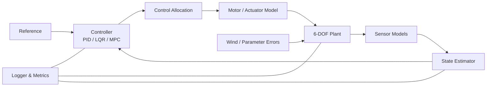

# 机器人与控制算法岗位准备规划（2026.08—2027.09）

> 适用对象：2028 届硕士，湖南大学；主投控制算法岗位，覆盖飞控与机器人运动控制。  
> 当前起点：C++ 处于语法与 STL 基础阶段；能阅读姿态估计、飞控和 Simulink 模块，但还不能独立完成“建模—控制—仿真—验证”的闭环；PX4、Gazebo、ROS2 环境可运行，尚缺少完整、可复现、可量化的作品；暂无稳定实机条件。  
> 计划周期：2026-08-03 至 2027-09-05。  
> 参考材料：[控制算法学习路线与岗位能力拆解](../控制算法.md)。

---

## 0. 先说结论：你的想法是否合适

### 0.1 Hot 100 值得刷，但不能成为主线

你的判断有一半非常正确：控制算法、飞控和机器人运动控制岗位确实可能要求手撕代码，C++ 也是重要筛选项，因此 Hot 100 应该准备。

需要修正的是它在整体规划中的位置：

- Hot 100 约占总投入的 **15%—20%**，作用是建立常见数据结构和算法模式、保证笔试与手撕代码不成为短板。
- 真正决定控制算法岗位竞争力的是：
  1. 能否独立建立动力学模型；
  2. 能否设计、分析并比较 PID、LQR、MPC、EKF 等算法；
  3. 能否用 C++ 写出结构清楚、可测试、可复现的工程代码；
  4. 能否完成 PX4/SITL 或机器人仿真的系统集成；
  5. 能否拿出量化结果并解释设计取舍、失败实验和工程问题。

因此不采用“先刷完题，再学控制，再做项目”的串行方式，而采用四条线并行：

```text
控制与数学主线
        ↓
四旋翼旗舰项目 ──→ C++ 工程化 ──→ PX4 SITL ──→ NN 残差控制
        ↓
机器人运控迁移项目

Hot 100、C++ 面试题和模拟面试贯穿全程
```

### 0.2 不要等到 2027 年 3 月才第一次投递

大疆官方当前页面显示：实习生招聘全年开放；2027 届校招在 2026 年 6 月 25 日就已启动、招满即止。这不能直接等同于 2028 届的具体日期，但足以说明控制类岗位的准备和投递需要前置。

本计划将节奏调整为：

- **2026 年 12 月**：完成简历 V1、项目 README V1 和演示材料；
- **2027 年 1 月**：开始少量试投，用真实反馈发现短板；
- **2027 年 2—4 月**：集中投递、笔试和面试；
- **2027 年 5 月前**：冻结 2028 届提前批/秋招作品集；
- **2027 年 6 月起**：持续跟踪 2028 届招聘，一旦开放就投，不等到 9 月。

招聘时间最终以各公司当年官方页面为准：[DJI 大疆校园招聘](https://careers.dji.com/zh-CN/campus)。

### 0.3 到 2027 年 2 月底应形成的能力画像

你需要能可信地说出并证明：

> 我能从零建立四旋翼 6-DOF 动力学模型，设计并比较串级 PID、LQR 和带约束 MPC，加入传感器噪声、执行器延迟、饱和、风扰以及质量和惯量偏差进行闭环验证；我能使用 Python 快速验证算法，并用 C++17、Eigen、CMake 和 GoogleTest 完成核心工程化；我能把控制器接入 PX4 SITL，使用 PyTorch 做最小神经网络残差补偿，并用统一指标解释效果与局限。

这比“Hot 100 刷了多少题”更接近目标 JD 真正需要的人。

---

## 1. JD 反推：要求、差距与作品证据

| JD 能力 | 当前主要差距 | 本计划中的任务 | 最终证据 | 截止时间 |
|---|---|---|---|---|
| 高保真控制仿真平台 | 能看模块，但缺少独立闭环与平台化设计 | 四旋翼 6-DOF、执行器、传感器、扰动、调度、评测 | 可一键复现的仿真仓库、场景配置、回归测试、指标报告 | 2026-12-31 |
| 现代控制基础 | LQR、MPC、估计、稳定性体系不完整 | 状态空间、线性化、可控/可观、LQR、KF/EKF、MPC | 推导笔记、实现代码、PID/LQR/MPC 对比实验 | 2027-01-31 |
| NN-Control/学习辅助控制 | 缺少可展示作品 | 学习未建模力/力矩残差，保留基线控制与安全限幅 | 未见工况测试、消融实验、失效回退、量化结论 | 2027-02-28 |
| 大型作业飞机/新构型 | 对质量、惯量、饱和、控制分配的工程理解不足 | 参数摄动、质心/惯量变化、执行器约束、控制分配 | 鲁棒性场景矩阵及失败边界说明 | 2027-02-28 |
| 嵌入式实现与系统集成 | C++ 工程能力偏弱，PX4 经验未形成作品 | C++17、Eigen、CMake、测试、性能测量、PX4 SITL 自定义模块 | 可编译模块、SITL 日志、控制周期与运行时间报告 | 2027-02-28 |
| C++/Python | C++ 尚未形成现代工程习惯 | Python 原型 + C++ 核心落地，算法题统一用 C++ | 代码审查清单、单元测试、Sanitizer/调试记录 | 持续 |
| 机器人运动控制 | 已有 ROS2/Nav2 基础，但底层动力学与控制作品不足 | 二自由度机械臂建模、轨迹与控制、ROS2 最小节点 | 机械臂控制小仓库、轨迹误差对比、演示 | 2027-05-15 |
| 论文/高阶方法加分 | 暂不具备论文级证据 | 先读懂和复现实用方法，再考虑 Koopman、Neural ODE、RL | 复现报告或负结果分析，不强求论文 | 2027-06 后 |
| 实机落地加分 | 暂无实机 | 先把 SIL/PX4 SITL 做扎实，接口为 HIL/实机保留 | 清楚说明软件验证边界，不虚构实机经验 | 持续 |

### 优先级边界

**P0：2027 年 2 月前必须完成**

- 四旋翼动力学、姿态表示、串级 PID、LQR、EKF、线性 MPC；
- C++17、STL、RAII、智能指针、CMake、Eigen、GoogleTest、基本并发与调试；
- 四旋翼旗舰项目、PX4 SITL、自述与量化实验；
- Hot 100 第一遍和 50 道核心题二刷；
- 简历、项目演示、模拟面试。

**P1：2027 年 5 月前完成**

- NN 残差控制的最小闭环与更完整验证；
- 二自由度机械臂运动控制项目和 ROS2 最小封装；
- 频域分析、系统辨识、鲁棒/自适应控制的面试级理解。

**P2：核心任务通过后再进入**

- H∞、MRAC、鲁棒 MPC 的完整实现；
- Koopman、Neural ODE、MPC+RL、Residual RL；
- HIL、真实无人机或机器人实验；
- 论文投稿。

P2 不能反过来挤压 P0。没有可靠基线时直接做 NN-Control 或 RL，通常只会得到无法解释的曲线。

---

## 2. 总体产出：一个旗舰项目、一个迁移项目、三套面试材料

### 2.1 旗舰项目：`aerial-control-lab`

目标：构建四旋翼高保真闭环控制与算法评测平台。

核心内容：

- Python：快速推导、画图、调参和算法原型；
- C++17 + Eigen：动力学、控制器、估计器、仿真调度和指标核心；
- CMake + GoogleTest：构建、单元测试和回归测试；
- OSQP：带状态/输入约束的线性 MPC；
- PX4 SITL：控制器模块接入和闭环验证；
- PyTorch：未建模扰动的神经网络残差补偿。

最终作品包：

1. 可一键构建和运行的代码；
2. 6 个以上标准场景；
3. PID/LQR/MPC/NN 的统一指标表；
4. 单元测试与回归测试；
5. 技术报告；
6. 2—4 分钟演示视频；
7. 3 分钟项目介绍、10 分钟深挖版本和项目问答库。

### 2.2 迁移项目：`planar-arm-control-lab`

目标：证明控制能力不局限于飞行器，可迁移到机器人运动控制。

内容：

- 二自由度平面机械臂正/逆运动学；
- 雅可比、奇异性和速度映射；
- 动力学模型：

$$
M(q)\ddot q + C(q,\dot q)\dot q + g(q) = \tau
$$

- 五次多项式轨迹；
- Joint PD、重力补偿、计算力矩控制，必要时加入局部 LQR；
- ROS2 最小控制节点与日志输出；
- 阶跃、正弦和轨迹跟踪对比。

### 2.3 面试材料

- **C++ 材料**：知识图谱、常见问答、20 个岗位编码任务、代码审查清单；
- **控制材料**：推导题、概念题、工程题和失败模式；
- **项目材料**：架构图、实验表、关键 bug、性能取舍、负结果和下一步。

---

## 3. 每周 48 小时时间预算

额外时间不预先填满。计划按每周 6 天、每天 8 小时执行，保留 1 天恢复。连续两周靠熬夜才能完成，说明计划需要裁剪，而不是继续增加时长。

### 3.1 2026 年 8—12 月：基本盘阶段

| 模块 | 每周小时 | 比例 | 说明 |
|---|---:|---:|---|
| 旗舰项目实现 | 16 | 33% | 模型、控制器、仿真、测试和实验 |
| 控制与数学 | 12 | 25% | 推导后立即进入项目，不只看课 |
| C++ 工程 | 8 | 17% | 语言、CMake、测试、调试、并发 |
| Hot 100 | 8 | 17% | 每周约 5 道新题及复习 |
| 阅读与复盘 | 4 | 8% | 文档、论文、周报和下周计划 |
| **合计** | **48** | **100%** |  |

### 3.2 2027 年 1—2 月：面试就绪阶段

| 模块 | 每周小时 |
|---|---:|
| MPC、PX4、NN 项目冲刺 | 16 |
| C++ 与算法题二刷 | 12 |
| 控制理论与项目问答 | 8 |
| 模拟面试、简历与投递 | 8 |
| 技术阅读与复盘 | 4 |
| **合计** | **48** |

### 3.3 2027 年 3—5 月：投递与能力迁移阶段

| 模块 | 每周小时 |
|---|---:|
| 飞控/PX4/NN 项目维护 | 10 |
| 机械臂迁移项目 | 8 |
| 投递、笔试和模拟面试 | 12 |
| C++ 与算法维护 | 8 |
| 控制理论查漏补缺 | 6 |
| 复盘和材料整理 | 4 |
| **合计** | **48** |

### 3.4 2027 年 6—9 月分支

**已经获得实习**

实习工作本身优先。课外只保留每周 8—10 小时：

- 算法/C++ 维护：3 小时；
- 控制理论与业务相关补课：3 小时；
- 作品集和实习复盘：2 小时；
- 招聘信息与周复盘：1 小时。

**尚未获得实习**

继续按 48 小时执行：

| 模块 | 每周小时 |
|---|---:|
| 项目深化和开源贡献 | 16 |
| 定向投递与面试 | 12 |
| C++ 与算法 | 8 |
| 控制/机器人理论 | 6 |
| 作品集与技术写作 | 4 |
| 周复盘 | 2 |
| **合计** | **48** |

---

## 4. 每周执行模板

具体钟点可按课程和实验室安排平移，但不改变每周总量。

### 周一至周四：学习和实现

| 时间块 | 时长 | 内容 |
|---|---:|---|
| 深度块 A | 3 h | 数学/控制推导并立即实现 |
| 深度块 B | 2 h | 旗舰项目功能开发或实验 |
| 代码块 | 1 h | C++ 专项、测试、调试或代码重构 |
| 算法块 | 1.5 h | Hot 100 新题或复习 |
| 收尾块 | 0.5 h | 提交代码、记录问题、写次日第一任务 |

### 周五：集成日

- 3 h：跨模块集成与调试；
- 2 h：本周 Hot 100 复习；
- 2 h：控制推导闭卷重写；
- 1 h：更新 README、实验记录和问题清单。

周五原则：停止盲目加功能，先把本周功能变成可运行、可测试、可解释的版本。

### 周六：验收与面试日

- 2 h：限时代码或完整模拟面试；
- 3 h：完成本周唯一硬交付；
- 1.5 h：实验报告与结果图；
- 1 h：查看目标 JD、整理面试反馈；
- 0.5 h：周复盘和下周任务拆分。

### 周日：恢复日

- 不安排硬任务；
- 最多用 30 分钟查看下周计划；
- 不用“补欠”侵占整天。若频繁需要周日补欠，应减少并行任务。

---

## 5. 13 个月月度路线总表

| 时间 | 本月主线 | 硬交付 | 月末通过标准 |
|---|---|---|---|
| 2026.08 | C++、数学和工程骨架 | Python/C++ 项目骨架、20 道 Hot 100 | 能独立构建测试工程并解释坐标与姿态约定 |
| 2026.09 | 6-DOF 与姿态/角速度控制 | 动力学、电机、混控、姿态 PID | 完成无噪声悬停与姿态阶跃 |
| 2026.10 | 串级位置控制与 C++ 移植 | 位置/速度/姿态/角速率闭环、60 题累计 | 轨迹和风扰场景稳定，Python/C++ 核心一致 |
| 2026.11 | 状态空间、LQR、KF | 线性模型、LQR、传感器与 KF | 与 PID 做统一指标对比 |
| 2026.12 | EKF 与高保真场景 | C++ V1、回归套件、Hot 100 首轮、简历 V1 | 一键复现 6 个场景并形成演示 |
| 2027.01 | 线性 MPC 与试投 | OSQP MPC、核心题二刷 25、试投反馈 | MPC 正确处理约束并给出运行时间 |
| 2027.02 | PX4、NN 最小闭环与面试 | PX4 SITL 模块、NN 残差、二刷 50、模拟面试 | 达到第 10 节“面试就绪门槛” |
| 2027.03 | 面试优先、机械臂建模 | 面试复盘闭环、2R 运动学/动力学 | 每次反馈 72 小时内形成改进 |
| 2027.04 | 机械臂控制与 ROS2 | PD/重力补偿/计算力矩、ROS2 节点 | 完成三类轨迹和统一评测 |
| 2027.05 | 作品集冻结 | 飞控+机械臂作品集、简历 V2 | 2028 届提前批材料可立即投递 |
| 2027.06 | 实习/提前批分支 | 实习上手计划或继续投递计划 | 每周有可审计的工作或投递产出 |
| 2027.07 | 工程深度 | 实习交付或项目性能/可靠性升级 | 能讲工程约束和真实失败案例 |
| 2027.08 | 2028 届招聘冲刺 | 简历 V3、面试题库 V3、投递漏斗 | 不因“还没学完”延迟投递 |
| 2027.09 上旬 | 阶段结算 | 13 个月复盘、下一阶段计划 | 作品、能力、投递结果有量化总结 |

---

## 6. 分月详细任务与验收

### 2026 年 8 月：基础重建

#### C++ 与工程

- 语法、函数、引用、`const`、指针、数组、字符串；
- 类、构造/析构、继承与多态的基本使用；
- STL：`vector`、`array`、`deque`、`list`、`map`、`unordered_map`、`set`、`priority_queue`；
- 迭代器、算法库、容器复杂度和失效规则；
- RAII、资源生命周期、智能指针入门；
- 编译、链接、头文件、静态库；
- CMake target 思维；
- GoogleTest 基本断言和测试夹具；
- Git 分支、提交和回退；Linux 命令行和基础调试。

#### 数学与控制

- 向量、矩阵、特征值、正定性；
- 一阶/二阶常微分方程；
- 欧拉法和 RK4；
- NED、ENU、FRD、FLU 的区别；
- 旋转矩阵、欧拉角、四元数；
- 明确本项目使用 `R_NB/q_NB` 表示从 FRD 机体系到 NED 世界系的旋转。

#### 项目

- 建立 `aerial-control-lab` 目录；
- Python 实现 `Vector/Quaternion` 验证脚本和最小积分器；
- C++ 建立 `core`、`tests`、`apps` 三类 target；
- 建立第一批测试：四元数归一化、单位旋转、逆旋转、RK4 常量导数。

#### 验收

- [ ] 能用一条命令配置、编译和运行 C++ 测试；
- [ ] 能闭卷解释 `R_NB` 的方向，写出向量在两个坐标系间的转换；
- [ ] 能解释栈/堆、值/引用/指针、RAII 和智能指针的作用；
- [ ] 完成 20 道 Hot 100，至少 14 道能在一周后独立重写；
- [ ] 项目没有把所有实现堆在一个文件中。

### 2026 年 9 月：四旋翼动力学与姿态闭环

#### 理论

- 平动方程、重力和总推力；
- 刚体转动方程：

$$
J\dot\omega + \omega \times J\omega = M
$$

- 四元数姿态积分与归一化；
- 电机转速平方到推力/反扭矩；
- 总推力/力矩到四电机的控制分配；
- 姿态误差、角速度误差、串级 PID。

#### 项目

- Python 实现 6-DOF 被控对象和电机一阶响应；
- 完成姿态环和角速度环；
- 完成理想状态反馈下的悬停与姿态阶跃；
- 记录每个状态量所属坐标系和单位；
- C++ 移植四元数、刚体动力学和 PID。

#### 验收

- [ ] 无控制时能正确表现自由落体；
- [ ] 理想悬停条件下 30 秒不发散、无 NaN，姿态保持在合理小误差内；
- [ ] 横滚/俯仰阶跃方向正确，没有坐标系符号错误；
- [ ] 能解释为什么角速度环位于最内层、为什么位置控制会产生期望姿态；
- [ ] Hot 100 累计 40 道。

### 2026 年 10 月：完整串级控制与 C++ V0

#### 理论

- 位置环、速度环、姿态环、角速度环的带宽层次；
- 前馈、限幅、抗积分饱和和输出变化率限制；
- 圆轨迹和时间参数化参考；
- 风扰与模型偏差。

#### 项目

- 完成位置—速度—姿态—角速度完整串级 PID；
- 加入圆轨迹、阵风和推力饱和；
- 建立 RMSE、超调量、稳定时间、饱和率指标；
- 将动力学、控制器、场景调度和指标移植到 C++；
- Python 负责画图和离线分析，避免维护两套互不一致的绘图逻辑。

#### 验收

- [ ] 悬停、位置阶跃、姿态阶跃、圆轨迹、风扰至少 5 个场景可配置运行；
- [ ] PID 具备输出限幅和抗积分饱和；
- [ ] Python/C++ 单步动力学和控制输出在给定容差内一致；
- [ ] 每个场景自动生成指标，不靠肉眼判断“看起来不错”；
- [ ] Hot 100 累计 60 道。

### 2026 年 11 月：状态空间、LQR 和 KF

#### 理论

- 平衡点、雅可比线性化；
- 连续/离散状态空间；
- 可控性、可观性；
- 极点、闭环稳定性、Lyapunov 基础；
- LQR 代价函数与 Riccati 方程；
- 随机变量、协方差、Kalman Filter；
- 采样频率、零阶保持和离散化。

#### 项目

- 对悬停附近模型进行线性化；
- 实现离散 LQR；
- 加入 IMU、GPS/位置观测的噪声和不同更新率；
- 先用线性 KF 验证估计链路，再进入 EKF；
- 使用相同场景、初值和指标比较 PID 与 LQR。

#### 验收

- [ ] 能手算一个低阶系统的可控/可观矩阵；
- [ ] 能解释 Q/R 调整对状态误差和控制代价的影响；
- [ ] LQR 闭环稳定，比较中不人为给某个控制器更有利的场景；
- [ ] KF 创新、协方差和估计误差有日志；
- [ ] Hot 100 累计 80 道。

### 2026 年 12 月：EKF、高保真平台与作品 V1

#### 理论

- 非线性状态转移/观测模型和雅可比；
- EKF 预测—更新；
- 传感器延迟、执行器延迟和控制周期抖动；
- 频域基本概念：带宽、相位裕度、增益裕度；
- 质量、惯量和推力系数误差。

#### 项目

- 完成 EKF 或最小可工作的非线性估计链路；
- 加入噪声、丢包/降频、延迟、死区、饱和、质量和惯量摄动；
- 建立固定随机种子的回归场景；
- 使用 Sanitizer/调试器检查明显内存和未定义行为问题；
- 完成 README、架构图、运行命令、场景表、结果表和演示视频。

#### 求职

- 简历 V1；
- 3 分钟项目介绍 V1；
- 建立目标 JD 表和投递漏斗；
- 找同学或师兄做第一次项目深挖。

#### 验收

- [ ] Hot 100 第一遍 100 题完成；
- [ ] 至少 6 个回归场景可一键运行；
- [ ] C++ 测试全部通过，固定种子时结果可重复；
- [ ] README 能让另一名同学在不口头指导的情况下运行主要实验；
- [ ] 简历只写已经完成、能经得起追问的结果。

### 2027 年 1 月：MPC 与第一次试投

#### 理论

- 二次规划；
- 离散预测模型、预测时域和控制时域；
- 状态/输入约束；
- 滚动优化、可行性和 warm start；
- MPC 与 LQR 的关系；
- 鲁棒控制、自适应控制、H∞、MRAC 的面试级概念。

#### 项目

- 使用 OSQP 实现线性 MPC；
- 先在低阶模型上验证，再接入四旋翼位置控制；
- 比较 PID、LQR、MPC 在推力饱和和轨迹约束下的行为；
- 统计平均、P95/P99 求解时间和不可行次数；
- 保存失败案例，不隐藏不可行和调参问题。

#### 求职

- 二刷 25 道核心题；
- 每周 2 次限时手撕；
- 完成简历 V1.1；
- 选择 5—8 个匹配岗位试投，观察笔试、简历和面试反馈。

#### 验收

- [ ] 能从头写出线性 MPC 的目标与约束；
- [ ] MPC 控制输入不违反已建模约束；
- [ ] 能解释求解器慢、不可行和模型不准时怎么办；
- [ ] 每次试投都有状态和反馈记录。

### 2027 年 2 月：PX4 SITL、NN 最小闭环和面试冲刺

#### PX4

1. 先用 ROS2/Offboard 跑通通信、时间戳、坐标系和 setpoint 链路；
2. 再新增或修改一个 PX4 控制模块并编译进 SITL；
3. 记录控制周期、消息延迟、饱和和日志；
4. Offboard 跑通不等于嵌入式集成完成，最低作品标准是存在可编译、可解释的 PX4 模块改动。

#### NN-Control

- 使用传统控制器产生基线；
- 采集有模型误差、风扰和执行器延迟的轨迹；
- 网络学习未建模力/力矩或状态预测残差，不直接端到端输出四电机命令；
- 控制结构：

$$
u_{\text{total}} = \operatorname{clamp}
\left(u_{\text{base}} + \operatorname{clamp}(u_{\text{NN}})\right)
$$

- 设置 NN 关闭、输出限幅、异常值检测和基线回退；
- 按“完整工况”划分训练/验证/测试集，禁止随机打散相邻时间步造成数据泄漏。

#### 面试

- 完成核心 50 题二刷；
- 每周 2 次完整模拟面试；
- 形成 C++、控制、项目三套问答；
- 2 月进入集中投递。

#### 验收

- [ ] PX4 SITL 中能运行自定义控制模块并导出日志；
- [ ] NN 在未见工况上与基线公平比较；
- [ ] 若 NN 未提升，能够用数据解释原因，不在简历中虚构提升；
- [ ] 常见 Hot 100 中等题能在 30—35 分钟内完成并主动测试边界；
- [ ] 能完成 3 分钟项目概述和 10 分钟技术深挖；
- [ ] 已完成不少于 8 次模拟面试或等价的严格互评。

### 2027 年 3 月：面试优先与机器人动力学

- 正式面试优先级高于继续堆项目功能；
- 每次面试 24 小时内完成复盘，72 小时内补齐一个可验证短板；
- 学习刚体运动、旋量/变换、机械臂正逆运动学、雅可比；
- 推导 2R 平面机械臂动力学；
- 保持每周 2—3 道算法题复习和 1 次限时代码。

验收：

- [ ] 面试反馈进入问题库，不重复犯同类错误；
- [ ] 能推导 2R 机械臂正运动学、雅可比和基本动力学；
- [ ] 投递漏斗每周更新一次。

### 2027 年 4 月：机器人运动控制

- 五次多项式轨迹生成；
- Joint PD；
- 重力补偿；
- 计算力矩控制；
- 奇异位置附近的数值处理；
- ROS2 最小节点：订阅状态/参考，发布关节力矩或仿真命令，记录日志。

验收：

- [ ] 阶跃、正弦、五次轨迹三类实验可运行；
- [ ] 至少比较两种控制器；
- [ ] 统一输出 RMSE、峰值误差、控制能量和运行时间；
- [ ] 能解释飞控与机械臂控制的共性和差异。

### 2027 年 5 月：作品集冻结

- 清理两个项目的 README、构建命令、配置、测试和结果；
- 更新简历 V2；
- 为每个项目准备架构图、实验表、关键代码路径和问题清单；
- 整理 6 个项目故事：
  1. 模型假设；
  2. 坐标系/符号 bug；
  3. 控制器选择；
  4. 约束和实时性；
  5. 系统集成；
  6. 失败实验和改进。
- 关注 2028 届招聘公告，材料保持随时可投。

验收：

- [ ] 简历、项目链接和演示视频均可用；
- [ ] 项目结果都能在代码或日志中追溯；
- [ ] 不把“了解”写成“熟练”，不把仿真写成实机；
- [ ] 至少完成一次由控制方向同学/老师进行的严格项目答辩。

### 2027 年 6—8 月：实习或替代性工程证据

#### 若获得实习

- 第 1—2 周：读文档、跑通构建和测试、画清数据流；
- 第 3—4 周：独立修复一个可验证问题或完成小功能；
- 第 2 个月：负责一个带指标的模块或实验；
- 第 3 个月：形成技术复盘，提炼可公开、去敏后的方法论；
- 不公开公司代码、数据、架构秘密或未披露产品信息。

#### 若尚未获得实习

- 每周 8—12 个定向岗位，不海投完全无关职位；
- 选择一个工程深化方向：
  - PX4 模块可靠性与性能；
  - NN 残差控制的泛化/消融；
  - 机械臂 ROS2/Gazebo 集成；
- 每两周必须产生一个可见交付：代码、测试、结果、文章或演示；
- 尝试对 PX4、控制/机器人开源项目提交小而完整的 issue/PR。

### 2027 年 9 月上旬：阶段结算

- 汇总 13 个月有效投入、完成率和偏差；
- 统计题目掌握率、模拟面试次数、项目指标、投递和面试转化；
- 更新简历 V3 和项目问答 V3；
- 根据真实面试反馈决定下一阶段主攻：
  - 飞控与嵌入式控制；
  - 机器人运动控制；
  - 学习辅助控制；
  - 控制仿真平台。

---

## 7. Hot 100 详细执行方案

题单入口：[LeetCode 热题 100](https://leetcode.cn/studyplan/top-100-liked/)。

### 7.1 第一遍：2026 年 8—12 月

| 月份 | 计划数量 | 重点模式 |
|---|---:|---|
| 8 月 | 20 | 数组、哈希、双指针、滑动窗口、链表基础 |
| 9 月 | 20 | 栈、队列、二分、堆、链表进阶 |
| 10 月 | 20 | 二叉树、递归、回溯 |
| 11 月 | 20 | 图、拓扑、并查集、贪心、动态规划基础 |
| 12 月 | 20 | 动态规划、区间技巧、综合题和此前欠题 |
| **合计** | **100** | 题目类别数量不完全均匀，以总完成和掌握度为准 |

### 7.2 单题流程

1. 5 分钟：复述输入、输出、约束和边界；
2. 35—45 分钟：独立推导，写出暴力解和优化方向；
3. 15 分钟：对照高质量解法，确认不变量；
4. 15 分钟：关闭答案，用 C++ 重新实现；
5. 10 分钟：补测试、复杂度、易错点和复习日期。

单题总耗时上限 60—90 分钟。超过上限后学习解法并进入复习队列，不用一道题吞掉半天。

### 7.3 掌握等级

| 等级 | 定义 | 后续动作 |
|---|---|---|
| A | 规定时间内独立完成，能解释正确性 | 进入 7/30 天复习 |
| B | 需要小提示后完成 | 1/3/7/30 天复习 |
| C | 看过核心思路才能完成 | 1/3/7 天重写 |
| D | 看懂后仍不能独立实现 | 补基础并在 24 小时内再做 |

一道题只有在两个不同日期都达到 A，才算真正掌握。

### 7.4 复习节奏

- 第 1 天：不看答案重写；
- 第 3 天：只写核心思路和关键代码；
- 第 7 天：限时完整实现；
- 第 30 天：混入模拟面试。

### 7.5 2027 年 1—2 月二刷

- 从 B/C/D 题、树/图/DP、常见中等题中选 50 道；
- 每周 6—7 道复习题；
- 每周 2 次 45 分钟限时代码；
- 目标不是背模板，而是能够：
  - 先讲清思路；
  - 写出可编译 C++；
  - 给出复杂度；
  - 主动覆盖空输入、单元素、重复值、溢出和越界；
  - 被追问后能修改方案。

### 7.6 2027 年 3 月后维护

- 每周 2—3 道旧题；
- 每周 1 次限时手撕；
- 面试遇到的新模式进入题库；
- 不再追求刷题数量，优先修复真实面试暴露的问题。

---

## 8. 20 个岗位相关 C++ 编码任务

这些任务对控制岗位的价值通常高于额外刷 20 道偏门算法题。

| 编号 | 任务 | 重点 |
|---:|---|---|
| 1 | 四元数乘法、归一化和向量旋转 | 坐标约定、数值稳定性 |
| 2 | 欧拉角/旋转矩阵/四元数互转 | 奇异性、边界测试 |
| 3 | Euler 与 RK4 通用积分器 | 模板/接口、误差比较 |
| 4 | 一阶低通滤波器 | 离散化、采样周期 |
| 5 | 双线性变换或简单离散化工具 | 数值计算 |
| 6 | 带抗积分饱和的 PID | 状态、限幅、测试 |
| 7 | 幅值限制与变化率限制器 | 边界与实时控制 |
| 8 | 定长环形缓冲区 | 索引、覆盖策略 |
| 9 | 有界线程安全队列 | mutex、condition_variable |
| 10 | 飞行模式状态机 | 状态转移与非法输入 |
| 11 | 固定频率调度器与抖动统计 | 时间、deadline |
| 12 | 时间戳插值与重采样 | 传感器不同步 |
| 13 | CSV/飞行日志解析器 | I/O、异常数据 |
| 14 | 数值雅可比 | 有限差分、步长 |
| 15 | 有限差分梯度检查 | 优化与 NN 验证 |
| 16 | 线性方程求解与条件数检查 | Eigen、病态矩阵 |
| 17 | 四旋翼控制分配器 | 矩阵、饱和、优先级 |
| 18 | 参数配置与合法性校验 | 类型、范围、错误处理 |
| 19 | 参数化单元测试套件 | GoogleTest、边界覆盖 |
| 20 | 控制循环 benchmark | 平均、P95/P99、超时 |

完成标准：不是“代码能跑”，而是有接口说明、边界处理、至少 3 个测试和复杂度/实时性说明。

---

## 9. 旗舰项目技术规格

### 9.1 建议目录

```text
aerial-control-lab/
├─ CMakeLists.txt
├─ README.md
├─ cpp/
│  ├─ include/
│  │  ├─ dynamics/
│  │  ├─ sensors/
│  │  ├─ estimation/
│  │  ├─ controllers/
│  │  ├─ allocation/
│  │  ├─ simulation/
│  │  └─ metrics/
│  ├─ src/
│  ├─ apps/
│  └─ tests/
├─ python/
│  ├─ prototype/
│  ├─ analysis/
│  └─ tests/
├─ configs/
│  ├─ vehicles/
│  └─ scenarios/
├─ px4/
│  ├─ module/
│  └─ sitl_tests/
├─ nn/
│  ├─ datasets/
│  ├─ training/
│  └─ evaluation/
├─ docs/
│  ├─ derivations/
│  ├─ architecture/
│  └─ experiments/
└─ scripts/
```

### 9.2 数据流



### 9.3 最小接口约定

```cpp
struct VehicleState {
    Vector3 position_ned;
    Vector3 velocity_ned;
    Quaternion q_nb;
    Vector3 angular_rate_body;
};

struct Reference {
    Vector3 position_ned;
    Vector3 velocity_ned;
    Vector3 acceleration_ned;
    double yaw;
};

struct WrenchCommand {
    double collective_thrust;
    Vector3 moment_body;
};

class Controller {
public:
    virtual WrenchCommand compute(
        const VehicleState& state,
        const Reference& reference,
        double dt) = 0;
    virtual ~Controller() = default;
};
```

约束：

- 状态、参考、控制量必须带有坐标系和单位说明；
- 控制器不直接访问被控对象内部状态；
- 场景通过配置注入参数、扰动、随机种子和控制器；
- 日志格式统一，所有控制器使用同一评测工具；
- Python 原型和 C++ 实现共用测试向量。

### 9.4 标准场景矩阵

| 场景 | 目的 | 主要变量 |
|---|---|---|
| 理想悬停 | 检查平衡、重力和符号 | 无噪声、无扰动 |
| 姿态阶跃 | 检查内环动态 | roll/pitch/yaw |
| 位置阶跃 | 检查完整串级 | 位置、速度限制 |
| 圆轨迹 | 检查连续跟踪 | 速度、曲率 |
| 阵风 | 检查扰动恢复 | 风幅值、持续时间 |
| 参数偏差 | 检查模型不确定性 | 质量、惯量、推力系数 |
| 执行器约束 | 检查饱和和延迟 | 幅值、变化率、时延 |
| 传感器退化 | 检查估计与闭环 | 噪声、降频、丢包 |

### 9.5 统一指标

- 位置/姿态 RMSE；
- 峰值误差和超调量；
- 进入误差带的稳定时间；
- 控制输入能量；
- 饱和时间占比；
- 约束违反次数；
- 平均、P95、P99 单步运行时间；
- 估计误差和创新统计；
- MPC 不可行次数；
- NN 异常输出/回退次数。

### 9.6 测试要求

单元测试至少覆盖：

- 四元数单位范数；
- 正/逆旋转一致；
- NED/FRD 重力和推力方向；
- 自由落体；
- 悬停平衡输入；
- PID 限幅和抗积分饱和；
- 控制分配与重构；
- 传感器固定随机种子；
- 执行器饱和/延迟；
- Python/C++ 单步输出一致性。

回归测试要求：

- 固定随机种子；
- 运行后自动生成指标；
- 关键指标超出阈值时测试失败；
- 不使用“只看一张曲线”作为验收。

### 9.7 性能目标

- PID/LQR 在开发机上 P99 计算时间显著低于对应控制周期；
- 若按 250 Hz 控制周期评估，MPC P99 目标为 4 ms 内；达不到时如实报告模型规模、时域、迭代和硬件；
- 代码无明显内存泄漏、越界和未定义行为；
- 所有性能结论同时给出测试平台和配置。

### 9.8 NN-Control 验收

- 训练、验证和测试按完整场景划分；
- 测试必须包含训练中未见的风扰、质量偏差或电机延迟；
- 和同一传统控制器、同一初值、同一场景比较；
- 成功目标：未见工况集合的中位 RMSE 至少下降 10%，且不以明显增加饱和或破坏名义工况为代价；
- 未达到目标时保留负结果和诊断，但简历不得写“显著提升”；
- 永远保留传统控制器、NN 限幅和关闭/回退开关。

---

## 10. 面试就绪门槛

2027 年 2 月 28 日前逐项验收。

### 10.1 手撕代码

- [ ] 常见中等题 30—35 分钟内完成；
- [ ] 先讲思路和不变量，再写代码；
- [ ] 能分析时空复杂度；
- [ ] 能主动覆盖边界；
- [ ] 能根据追问修改代码，而不是只会背模板。

### 10.2 C++ 工程

- [ ] 解释对象生命周期、RAII、copy/move、智能指针；
- [ ] 解释虚函数、多态、对象切片和析构问题；
- [ ] 知道主要 STL 容器的复杂度和迭代器失效；
- [ ] 理解栈/堆、对齐、悬空指针、内存泄漏；
- [ ] 能写基本线程、互斥锁、条件变量和有界队列；
- [ ] 能独立使用 CMake、GoogleTest、调试器和 Sanitizer；
- [ ] 能说明实时控制代码中为什么避免不可控分配、阻塞和大抖动。

### 10.3 控制理论

- [ ] 推导四旋翼平动和转动方程；
- [ ] 解释姿态、角速度、速度和位置环的关系；
- [ ] 解释 PID、前馈、限幅和抗积分饱和；
- [ ] 会做线性化、可控/可观分析；
- [ ] 解释 LQR 的 Q/R 和稳定性；
- [ ] 解释 KF/EKF 的预测、更新和协方差；
- [ ] 写出 MPC 目标、动力学和约束；
- [ ] 理解采样、延迟、噪声、饱和和模型误差如何影响闭环；
- [ ] 能说清鲁棒控制、自适应控制、H∞、MRAC 的问题定义和使用边界；
- [ ] 能比较飞控与机械臂控制的状态、输入、约束和控制频率。

### 10.4 项目表达

- [ ] 30 秒：一句话说明项目解决什么问题；
- [ ] 3 分钟：问题、架构、本人工作、结果；
- [ ] 10 分钟：模型、控制器、实验、失败和取舍；
- [ ] 能从结果数字追溯到脚本、配置和日志；
- [ ] 能解释一个严重 bug、一个失败实验和一个性能优化；
- [ ] 清楚说明仅为仿真/SITL，不冒充实机。

### 10.5 模拟面试结构

一次完整模拟面试约 90 分钟：

1. 10 分钟：自我介绍和岗位动机；
2. 20 分钟：C++；
3. 25 分钟：手撕代码；
4. 20 分钟：控制理论；
5. 15 分钟：项目深挖。

结束后必须形成：不会的问题、错误原因、补救任务、再次验证日期。

---

## 11. 投递策略与漏斗

### 11.1 岗位范围

主投：

- 飞控算法；
- 控制算法；
- 运动控制；
- 机器人控制；
- 控制仿真平台；
- 无人机/机器人嵌入式算法；
- 状态估计与控制融合。

谨慎投递：

- 完全偏感知、纯大模型或纯业务开发且与目标能力无关的岗位；
- 要求多年实机量产经验的社招岗位；
- 只因为公司名气而与个人证据完全不匹配的岗位。

### 11.2 节奏

- 2026.08—11：建立 JD 样本库，每周分析 2—3 份，不正式海投；
- 2026.12：简历 V1，请老师/师兄严格审查；
- 2027.01：每周 5—8 个试投岗位；
- 2027.02—04：每周 8—12 个高匹配岗位，并保留笔试/面试时间；
- 2027.05：冻结 2028 届材料；
- 2027.06 起：提前批/校招一旦开放立即投递。

### 11.3 面试反馈闭环

- 24 小时内：还原问题和自己的回答；
- 48 小时内：补理论或重写代码；
- 72 小时内：用一次测试、推导或模拟问答验证；
- 一周内：把新问题合并进长期题库。

### 11.4 投递漏斗字段

| 公司/团队 | 岗位 | JD 关键词 | 匹配证据 | 缺口 | 投递日期 | 阶段 | 面试反馈 | 下一动作 | 截止日 |
|---|---|---|---|---|---|---|---|---|---|
|  |  |  |  |  |  |  |  |  |  |

每周看转化率而不只看投递数：

```text
有效投递 → 简历通过 → 笔试 → 一面 → 后续面 → Offer
```

若连续 20 个高匹配投递没有面试，优先检查简历和岗位匹配；若频繁挂笔试，增加代码训练；若进入面试但不通过，按具体环节补洞。

---

## 12. 里程碑检查表

### 2026-08-31

- [ ] C++/CMake/GoogleTest 工程骨架；
- [ ] 坐标系、旋转和积分测试；
- [ ] Hot 100 完成 20；
- [ ] 建立周报与实验记录。

### 2026-10-31

- [ ] 四旋翼 6-DOF 与完整串级 PID；
- [ ] 至少 5 个场景；
- [ ] C++ V0；
- [ ] Hot 100 累计 60。

### 2026-12-31

- [ ] PID/LQR/KF/EKF；
- [ ] 高保真噪声、延迟、饱和和参数偏差；
- [ ] Hot 100 第一遍；
- [ ] README、报告、演示和简历 V1。

### 2027-02-28

- [ ] MPC；
- [ ] PX4 SITL 自定义控制模块；
- [ ] NN 残差控制最小闭环；
- [ ] 50 道核心题二刷；
- [ ] 不少于 8 次模拟面试；
- [ ] 正式投递进行中。

### 2027-05-31

- [ ] 2R 机械臂项目；
- [ ] ROS2 最小控制节点；
- [ ] 飞控/机器人作品集；
- [ ] 简历 V2；
- [ ] 2028 届招聘材料可立即投递。

### 2027-09-05

- [ ] 实习交付或等价工程作品；
- [ ] 简历 V3、项目问答 V3；
- [ ] 投递与面试数据复盘；
- [ ] 下一阶段方向决策。

---

## 13. 可复制模板

### 13.1 周计划与复盘

```markdown
## 第 __ 周：____-__-__ 至 ____-__-__

### 本周唯一硬交付
- 

### 计划工时
- 项目：
- 控制/数学：
- C++：
- 算法题：
- 面试/投递：
- 阅读/复盘：

### 完成情况
- [ ] 

### 本周数据
- 实际有效工时：
- 新题 / 复习题：
- 测试新增：
- 回归场景：
- 投递 / 笔试 / 面试：

### 最大问题
- 现象：
- 根因：
- 证据：
- 下周动作：

### 下周第一任务
- 
```

### 13.2 每日记录

```markdown
## 日期：____-__-__

- 今日最重要交付：
- 深度工作时长：
- 完成：
- 未完成：
- 一个新理解：
- 一个 bug / 风险：
- 对应代码、图或日志：
- 明天开始后的第一步：
```

### 13.3 算法题记录

```markdown
## 题目：

- 日期：
- 模式：
- 首次等级：A / B / C / D
- 核心不变量：
- 解法：
- 时间复杂度：
- 空间复杂度：
- C++ 易错点：
- 边界用例：
- 复习：D+1 / D+3 / D+7 / D+30
```

### 13.4 控制实验记录

```markdown
## 实验名称：

- 日期 / commit：
- 问题与假设：
- 被控对象版本：
- 控制器与参数：
- 场景配置 / 随机种子：
- 对照组：
- 指标：
- 结果：
- 是否支持假设：
- 失败/异常：
- 下一实验：
```

### 13.5 面试复盘

```markdown
## 公司 / 岗位 / 日期：

- 面试阶段：
- 问题原文：
- 我的回答：
- 面试官追问：
- 错误类型：不会 / 理解错 / 表达差 / 代码 bug / 项目证据不足
- 正确答案或更好回答：
- 48 小时补救：
- 72 小时验证：
- 是否加入长期题库：
```

---

## 14. 资源使用清单

原则：资源只为当前交付服务，不按“从头到尾看完一本书/一套课”衡量进度。

### C++ 与工程

- [C++ Core Guidelines](https://isocpp.github.io/CppCoreGuidelines/CppCoreGuidelines.html)：重点看接口、资源管理、类、并发；
- [cppreference](https://en.cppreference.com/)：作为语言和标准库查询手册；
- [CMake 官方教程](https://cmake.org/cmake/help/latest/guide/tutorial/index.html)：完成 target、库、测试相关章节；
- [Eigen Getting Started](https://eigen.tuxfamily.org/dox/GettingStarted.html)：矩阵、块、分解和对齐注意事项；
- [GoogleTest](https://google.github.io/googletest/)：Primer、测试夹具和参数化测试。

### 算法题

- [LeetCode 热题 100](https://leetcode.cn/studyplan/top-100-liked/)；
- 不额外购买大量题单，先完成“100 第一遍 + 50 核心二刷 + 20 岗位编码任务”。

### 控制、飞控与优化

- Karl J. Åström、Richard M. Murray：《Feedback Systems》；
- Randal W. Beard、Timothy W. McLain：《Small Unmanned Aircraft》；
- [MIT Underactuated Robotics](https://underactuated.csail.mit.edu/)：四旋翼、LQR、Lyapunov、轨迹优化、鲁棒与学习控制；
- [OSQP MPC 示例](https://osqp.org/docs/examples/mpc.html)：先理解标准线性 MPC，再改造成自己的模型。

### PX4 与 ROS2

- [PX4 Simulation QuickStart](https://docs.px4.io/main/en/simulation/px4_simulation_quickstart)；
- [PX4 ROS2 User Guide](https://docs.px4.io/main/en/ros/ros2_comm.html)；
- 使用与现有系统兼容的已验证 PX4/ROS2/Gazebo 组合，不为追最新版反复重装环境。

### 机器人运动控制

- [Modern Robotics](https://hades.mech.northwestern.edu/index.php/Modern_Robotics)：运动学、雅可比、动力学、轨迹和控制；
- 优先学习能直接进入 2R 项目的章节。

### NN-Control

- [PyTorch Tutorials](https://docs.pytorch.org/tutorials/)；
- 先完成残差回归、数据划分、归一化、训练曲线和闭环验证；
- 不在传统控制基线完成前进入纯 RL。

---

## 15. 风险与纠偏规则

### 风险 1：课程收藏很多，代码和结果很少

纠偏：每学习一个概念，48 小时内必须产生推导、测试或项目改动。没有产出就不算完成。

### 风险 2：Hot 100 挤占控制项目

纠偏：算法题硬上限为每周 8—12 小时。项目延期时不能通过无限刷题获得“努力感”。

### 风险 3：同时开太多项目

纠偏：2027 年 2 月前只允许一个旗舰项目。机械臂项目在飞控项目完成面试版本后再启动。

### 风险 4：只展示漂亮曲线

纠偏：所有结论必须有对照组、配置、随机种子和指标；保留失败边界。

### 风险 5：因“还没准备好”推迟投递

纠偏：2027 年 1 月到点试投。真实面试反馈是计划的一部分，不是准备完成后的奖励。

### 风险 6：强度过高导致失速

纠偏：

- 连续两周计划完成率低于 70%，先删 P2 阅读和额外功能；
- 项目延期超过两周，依次删掉纯 RL、Koopman、Neural ODE、完整 H∞/MRAC 实现；
- 不删除睡眠、恢复日、PID/LQR/MPC/PX4/测试和投递；
- 每 6 周安排一个 70% 负荷周，用于补文档、修 bug 和恢复。

### 风险 7：没有实机而焦虑

纠偏：明确把 SIL/PX4 SITL 做到可复现、可测量、可解释。实机是加分项，不是虚构经历的理由；后续获得实验室资源时，再按安全流程增加 HIL/实机。

---

## 16. 最终原则

1. **以证据代替“学过”**：代码、测试、指标、报告和演示才是完成。
2. **以一个主项目串起知识**：数学、控制、C++、PX4 和 NN 不再各学各的。
3. **先基线，再高级方法**：PID/LQR/MPC 没有公平基线时，不做 NN/RL 宣传。
4. **按时投递，不等完美**：2027 年 1 月试投，2—4 月进入主战场。
5. **诚实说明边界**：仿真就是仿真，SITL 就是 SITL，负结果也可以体现工程判断。
6. **面试目标不是背答案**：要能推导、写代码、解释失败并把结论指向真实项目证据。

如果严格执行，本计划的目标不是保证拿到某一家公司的 Offer，而是到 2027 年春季形成一套能够匹配大多数飞控、控制算法和机器人运动控制实习岗位的可信能力闭环。
